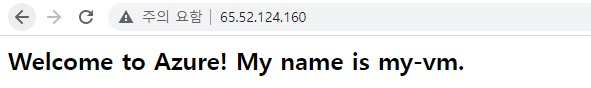

# Azure Virtual Machine

Azure 가상머신에 Nginx 설치 실습

## 요약

1. VM 생성 및 Nginx 설치
2. 인바운드 엑세스에서 80포트(http) 오픈하기

참고링크: [https://learn.microsoft.com/ko-kr/training/modules/describe-azure-compute-networking-services/3-exercise-create-azure-virtual-machine](https://learn.microsoft.com/ko-kr/training/modules/describe-azure-compute-networking-services/3-exercise-create-azure-virtual-machine)

## 1. Linux 가상 머신 만들기 및 Nginx 설치

1. Azure CLI 명령을 입력한다.

```bash
az vm create \
  --resource-group learn-d4140115-a725-4719-8d5c-f7ebf4ac751b \
  --name my-vm \
  --image UbuntuLTS \
  --admin-username azureuser \
  --generate-ssh-keys
```
* ubuntu OS를 my-vm 가상머신에 설치한다.

2. VM에 아래의 코드로 Nginx를 설치한다.

```bash
az vm extension set \
  --resource-group learn-d4140115-a725-4719-8d5c-f7ebf4ac751b \
  --vm-name my-vm \
  --name customScript \
  --publisher Microsoft.Azure.Extensions \
  --version 2.1 \
  --settings '{"fileUris":["https://raw.githubusercontent.com/MicrosoftDocs/mslearn-welcome-to-azure/master/configure-nginx.sh"]}' \
  --protected-settings '{"commandToExecute": "./configure-nginx.sh"}'
```

## 2. 네트워크 액세스 구성

* 포트 80에서 인바운드 HTTP 액세스를 허용하여 이를 변경하는 네트워크 보안 그룹을 만드는 것을 목표로 한다.

```bash
IPADDRESS="$(az vm list-ip-addresses \
  --resource-group learn-d4140115-a725-4719-8d5c-f7ebf4ac751b \
  --name my-vm \
  --query "[].virtualMachine.network.publicIpAddresses[*].ipAddress" \
  --output tsv)"
```

* IPADDRESS에 VM의 IP 주소를 가져오고 결과를 저장한다.

```bash
curl --connect-timeout 5 http://$IPADDRESS
```

* 홈페이지를 다운로드 한다. 

```bash
curl: (28) Connection timed out after 5001 milliseconds
```

*  5초가 지나면 연결 시간이 초과되었음을 나타내는 오류 메시지가 표시되게 허용한다.

```bash
az network nsg list \
  --resource-group learn-d4140115-a725-4719-8d5c-f7ebf4ac751b \
  --query '[].name' \
  --output tsv
```

* 연결을 위하여 네트워크 보안 그룹을 나열한다.

```bash
# Json 파일로 확인
az network nsg rule list \
  --resource-group learn-d4140115-a725-4719-8d5c-f7ebf4ac751b \
  --nsg-name my-vmNSG

# 좀 더 보기 쉽게 나타내기
az network nsg rule list \
  --resource-group learn-d4140115-a725-4719-8d5c-f7ebf4ac751b \
  --nsg-name my-vmNSG \
  --query '[].{Name:name, Priority:priority, Port:destinationPortRange, Access:access}' \
  --output table
```

* my-vmNSG라는 NSG와 연결된 규칙을 Json 파일로 확인한다.

```bash
az network nsg rule create \
  --resource-group learn-d4140115-a725-4719-8d5c-f7ebf4ac751b \
  --nsg-name my-vmNSG \
  --name allow-http \
  --protocol tcp \
  --priority 100 \
  --destination-port-range 80 \
  --access Allow
```

* 인바운드 액세스를 사용하여 80포트를 개방한다.

```
az network nsg rule list \
  --resource-group learn-d4140115-a725-4719-8d5c-f7ebf4ac751b \
  --nsg-name my-vmNSG \
  --query '[].{Name:name, Priority:priority, Port:destinationPortRange, Access:access}' \
  --output table
```

* 80 포트가 열렸는지 확인한다.

```bash
echo $IPADDRESS
```

* VM에서 받은 IP를 찾아서 웹브라우저에 입력하여 결과를 확인한다.

