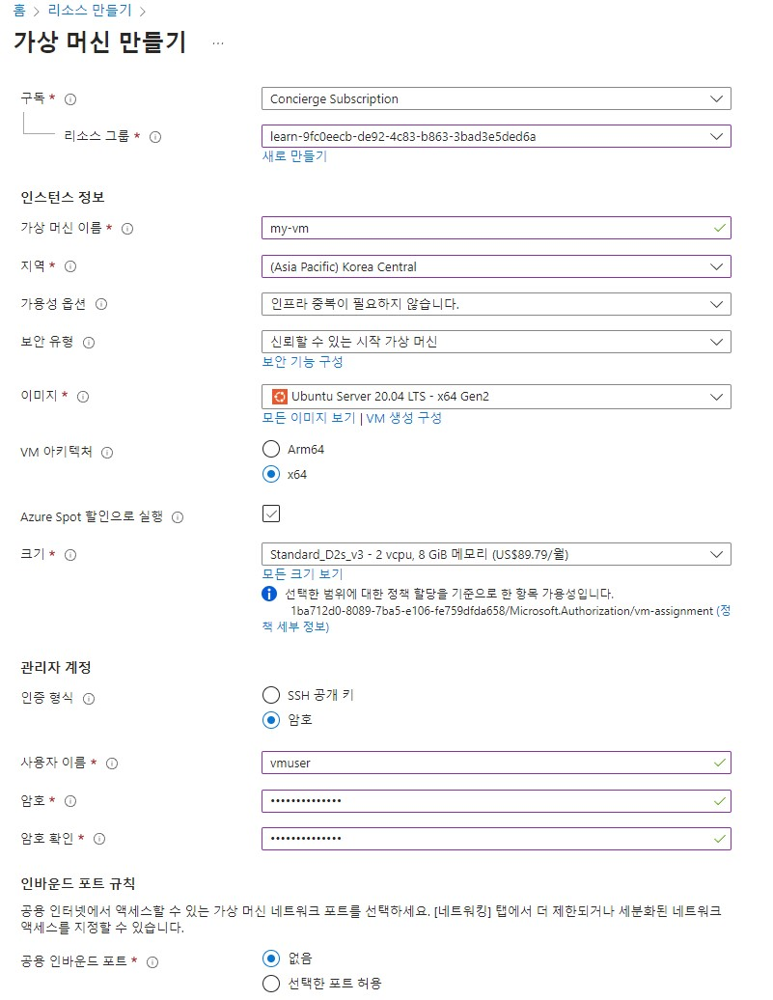
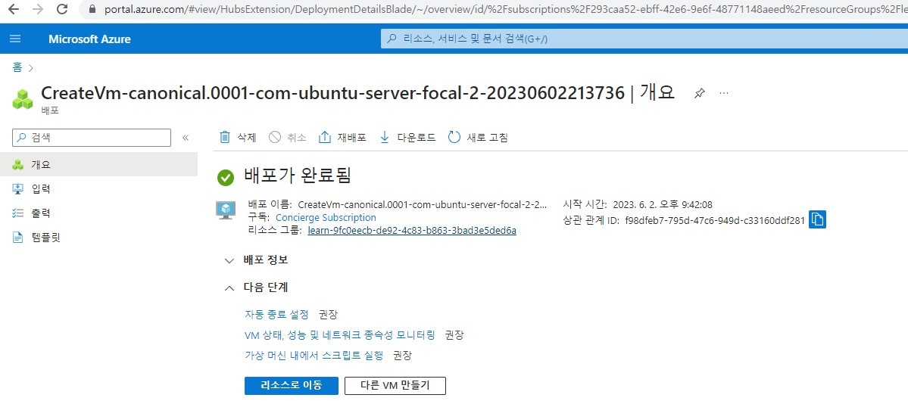

# Azure 리소스 만들기

Azure 가상머신 리소스 만들기

## 요약

1. 리소스 그룹 생성
2. 가상 머신 리소스 생성

* 본 실습에서는 샌드박스가 자동으로 리소스 그룹을 learn으로 생성합니다.

참고 링크: [https://learn.microsoft.com/ko-kr/training/modules/describe-core-architectural-components-of-azure/7-exercise-create-azure-resource](https://learn.microsoft.com/ko-kr/training/modules/describe-core-architectural-components-of-azure/7-exercise-create-azure-resource)

## 가상머신 리소스 만들기

* Azure Portal에 로그인 한다.
* 리소스 만들기 > 컴퓨팅 > 가상 머신 > 만들기를 선택한다.
* 아래와 같이 입력하여 가상머신을 생성한다.

* 이후 나머지 세팅은 기본값으로 한 후 생성한다.

