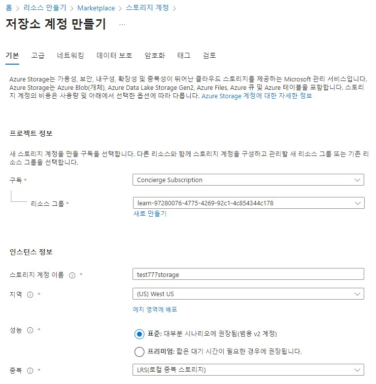
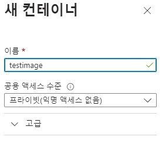
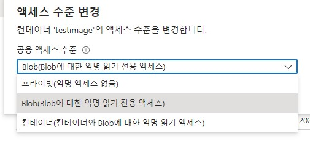
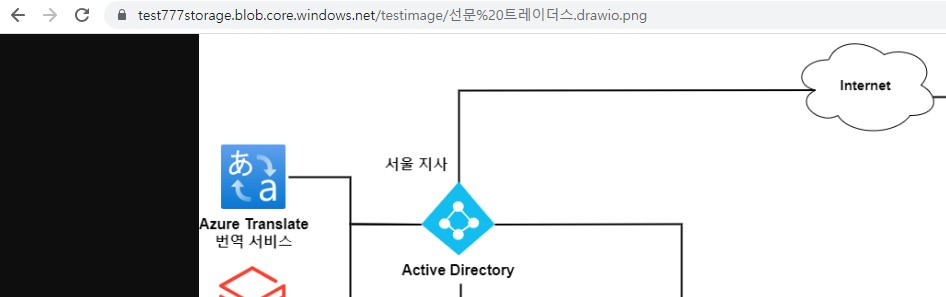

# Azure Storage

Azure Storage는 Microsoft Azure 클라우드 플랫폼에서 제공하는 스토리지 서비스이며, 이 서비스를 사용하면 데이터를 신속하게 저장, 검색 및 조작할 수 있다.

### Azure Data Lake와 차이는?

* Azure Storage는 비정형 데이터(이미지, 동영상, 문서 등)와 구조화되지 않은 데이터를 저장하기 위한 일반적인 스토리지 서비스이며, 단순한 파일 및 객체 저장소로 사용되며, 데이터를 빠르게 읽고 쓸 수 있다.

* Azure Data Lake는 대규모의 정형 및 비정형 데이터를 저장하고 처리하기 위한 고급 데이터 스토리지 및 분석 서비스이다. Azure Data Lake은 Azure Storage 위에 구축된 서비스로, 큰 규모의 데이터를 효과적으로 저장하고 처리할 수 있다.

## 요약

1. 스토리지 계정 리소스 생성
2. 컨테이너 생성
3. 액세스 수준 변경

참고 링크: [https://learn.microsoft.com/ko-kr/training/modules/describe-azure-storage-services/5-exercise-create-storage-blob](https://learn.microsoft.com/ko-kr/training/modules/describe-azure-storage-services/5-exercise-create-storage-blob)

## 1. 스토리지 계정 리소스 생성

## 2. 컨테이너 생성

* 컨테이너는 Blob Storage 서비스의 논리적인 컨테이너 단위이다.
*  Blob은 컨테이너 내에서 관리되며, 컨테이너는 Blob을 그룹화하고 구조화하는 데 사용된다.

* 위와 같이 새로운 컨테이너를 생성한다.

## 3. 액세스 수준 변경

* 액세스를 익명 읽기 전용으로 변경해야 외부에서 URL을 가지고 접속할 수 있다.

