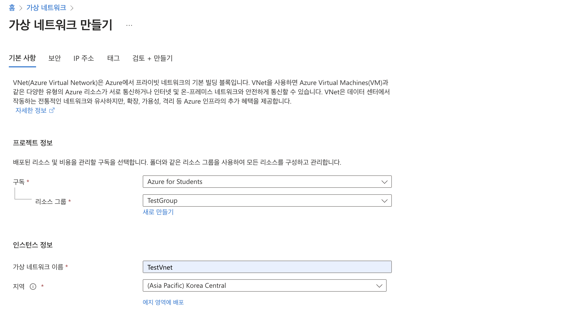
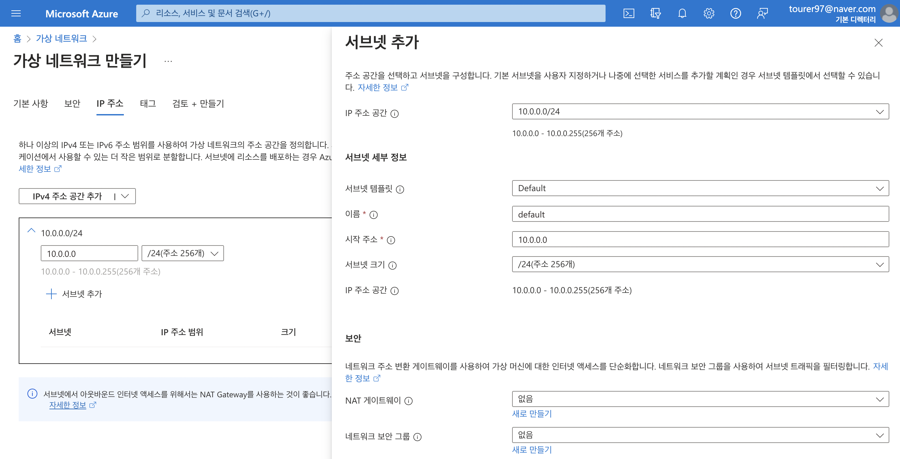
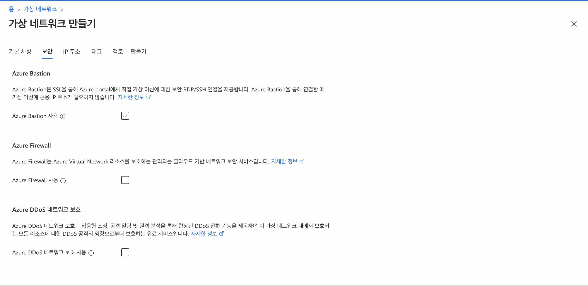

# 가상 네트워크(Vnet)

* 기본적인 서브넷팅에 대한 개념이 있어야 한다.

## 사설IP주소
- 이러한 주소는 라우터에서 약속되어 있어서 라우터 들어오더라도 외부로 안나가고 내부로 다시 들어오게 된다.

1. 10.0.0.0 - 10.255.255.255 (10/8 prefix)
2. 172.16.0.0 - 172.31.255.255 (172.16/12 prefix)
3. 192.168.0.0  - 192.168.255.255 (192.168/16 prefix) 

- 가상 네트워크를 통하여 할당 받은 사설IP 주소들을 서브넷을 추가하여 나누어서 사용할 수 있다.
- 하나의 서브넷으로 사용할 경우 아래와 같이 x.x.x.0 에 맞추어 사용하면 된다. 

## 예약된 주소

1. x.x.x.0: 네트워크 주소
2. x.x.x.1: Azure 기본 게이트웨이
   - 다른 네트워크를 연결해주는 특정 장비나 호스트를 게이트웨이라고 하며, 라우터를 생각하는 것이 좋다.
3. x.x.x.2, x.x.x.3: Azure의 DNS IP들에 대한 VNet 공간이다.
4. x.x.x.255: 브로드캐스트 주소이다.
   - 네트워크에 속하는 모든 호스트들이 듣게되는 주소이다.

## 인바운드와 아웃바운드

- 인바운드: 인바운드는 쉽게 설명하면 외부에서 내부 네트워크에 접속하는 것으로 ip를 타고 들어와서 대표적인 80(http), 443(https), 22(ssh) 포트에 접속하는 행위를 뜻한다.  
  - 이 때 Azure에서 제공하는 솔루션으로 gateway인 로드밸런서, 애플리케이션 게이트웨이 등이 있다.  
- 아웃바운드: 아웃바운드는 인바운드와 반대로 내부 네트워크에서 인터넷으로 데이터를 전송하는 것을 뜻한다.
   - 이 때 Azure에서 제공하는 솔루션으로 NAT Gateway가 있다.
