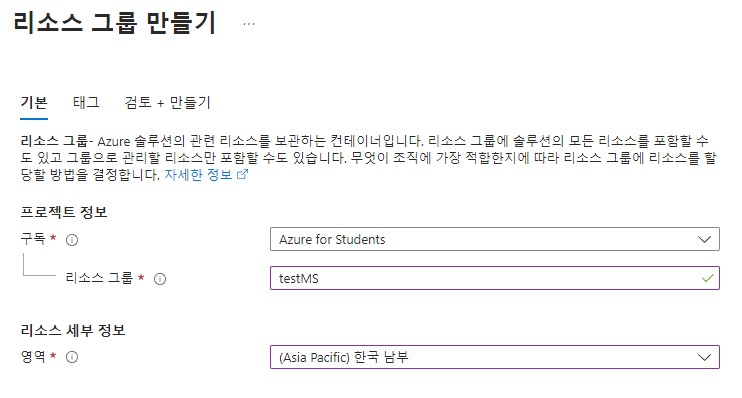
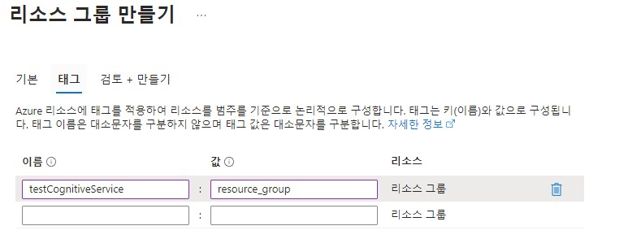
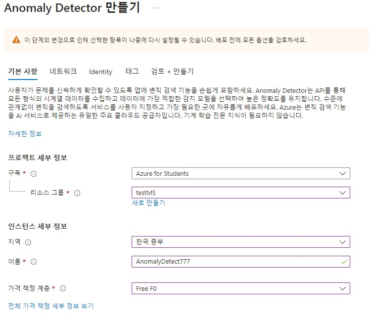
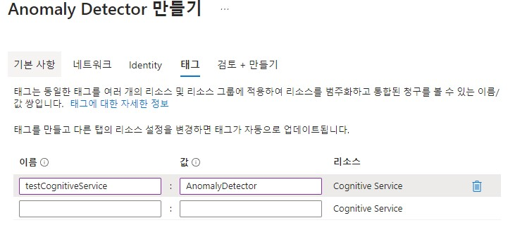
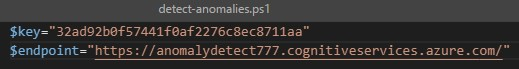
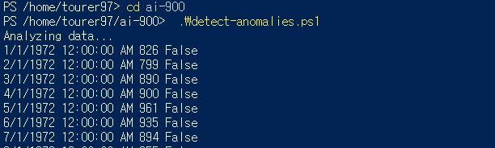
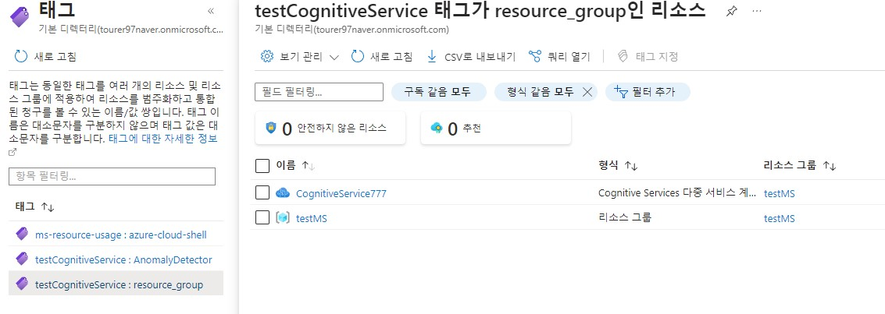

# Cognitive Services

Azure에서 제공하는 영상 처리, 음성, 언어 및 의사결정 서비스를 제공한다.  
좀 더 쉽게 생각하면 어려운 인공지능 기술을 Azure에서 API 형태로 서비스를 제공한다.  


## 요약 
1. 리소스 그룹 만들기
2. powershell 만들기
3. Anomaly Detector 만들기
4. API 결과 TRUE/Flase 확인
5. TMI) tag 사용법

## 리소스 그룹 만들기



1. 제일 처음 애저를 사용하기 위해서 고려할 것은 구독이다. (2023년 기준) 대학 4학년 2학기 막 학기로 학생 구독을 발급받았다.
2. Azure에서 제공하는 서비스를 사용할 그룹을 만든다. 그룹 안에는 여러 리소스(서비스 및 기능)를 사용할 수 있다.
3. 사용할 지역 위치를 만든다.



태그에 대한 내용은 아래에서 설명하겠다.

## Anomaly Detector 만들기


상단에서 만들었던 리소스 그룹을 추가하여 리소스를 만들어준다.


여기도 위와는 key 값은 같고 value 값은 다르게 태그를 추가하여 준다.


## ai-900 저장소 clone

```bash
 git clone https://github.com/MicrosoftLearning/AI-900-AIFundamentals ai-900
 code .
```
샘플 코드를 깃으로 내려받은 후 __detect-anomalies.ps1__ 파일을 오픈한다.

## Cognitive Services key와 endpoint 입력



## 실습 및 결과



```bash
cd ai-900
.\detect-anomalies.ps1
```

Azure powershell에 위에 명령어를 입력하여 결과가 나온 것을 확인할 수 있다.

# TMI) 태그란 무엇일까?  

Azure에서는 사용하느 리소스를 묶을때는 리소스 그룹을 사용하여 원하는 구독과 사용자로 한 번에 묶어서 사용하는 모습을 볼 수 있었다.

## 그렇다면 서로 다른 리소스 그룹에서 사용하는 같은 서비스를 묶고 싶다면?

* 아마 이렇게 질문하여 탄생한 것이 태그 기능이다. 
* 태그는 "key && value"의 형태로 이루어져 있으면 이를 통하여 서로 다른 리소스들을 묶어서 사용할 수 있다.

## key는 동일한데 value 값을 다르게 하면 어떻게 되는가?



* 정답은 전혀 다른 태그가 된다.
* testMS의 태그와 Anomaly Detector 태그는 위의 사진과 같이key값은 동일하지만 value 값이 다르다.
* 따라서 태그로 묶기 위해서는 key와 value 모두 일치해야 한다.