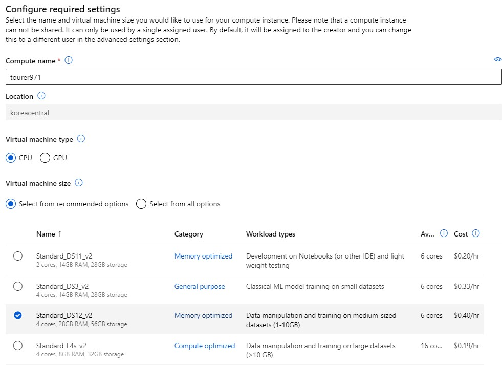

# Automated Machine Learning in Azure ML

Azure Machine Learning 리소스를 사용하여 자동화된 기계학습을 사용할 수 있습니다.

요약
1. 작업공간 및 가상 머신 생성
2. 데이터셋 만들기
3. 모델 학습(Automated Training)
4. endpoint 생성
5. 모델 추론(Inference)

참조 링크: [https://microsoftlearning.github.io/AI-900-AIFundamentals/instructions/02-module-02.html](https://microsoftlearning.github.io/AI-900-AIFundamentals/instructions/02-module-02.html)

## WorkSpace 작업공간 생성

Microsoft Azure Machine Learning Studio에서 작업공간을 만들어준다. 

## 컴퓨팅 생성

* 기계학습을 할 가상 머신을 선택한다.
* cpu와 gpu를 선택할 수 있으며 가벼운 모델을 만들 기 위해 cpu를 생성한다.
* 10GB 이하의 데이터셋을 고성능으로 학습하기 위하여 DS12_v2를 선택한다.

## 데이터 셋 만들기

왼쪽 편에 있는 Assets 목록 아래에 있는 Data를 클릭하여 Dataset을 만들어준다.  
* 데이터는 [https://aka.ms/bike-rentals](https://aka.ms/bike-rentals) 에서 제공하는 데이터를 사용하였다.  

* 데이터셋의 이름과 설명을 추가한다.
* type는 가상 머신에 맞춰서 설정한다.  

* 데이터셋을 어디서 받을지 정한다.
* 여기서 우리는 __From web files__ 를 선택한다.

* 위에 적힌 URL을 넣어준다.

* URL로 부터 받아 온 CSV파일을 어떠한 형식으로 읽을 것인지 정한다.
* ex) 헤더, 문자열 형식(UTF-8)

* 데이터 셋 중에 어떠한 열말 선택하여 사용할지 정한다.
* Path 열은 제외한다.

* 데이터 셋을 생성한다.

## 기계학습 자동화 작업

Azure에서 최적의 모델을 적용하여 회귀학습을 진행한다.
* Workspace -> Authoring -> Automated ML 에 있다.

* 먼저 학습할 데이터 셋을 정한다.
* 그 후, compute type를 통하여 Compute instance와 Compute cluster를 정한다.
* __Compute instance__ : 개별 가상 머신(VM) 인스턴스로서, 사용자가 필요에 따라 VM을 시작하고 중지할 수 있다. 개발, 디버깅 및 모델 학습 등의 작업에 사용할 수 있으며, 예를 들어, Jupyter notebook과 같은 인터페이스를 통해 데이터 분석, 시각화 및 모델 학습을 할 수 있다.
* __Computer cluster__ : 여러 대의 VM 인스턴스를 그룹화한 것이다. Compute Cluster는 대규모 데이터 세트 또는 복잡한 모델 학습 작업을 처리하는 데 유용하다. Compute Cluster를 사용하면 작업을 병렬로 실행하고 작업에 필요한 컴퓨팅 리소스를 더 쉽게 관리할 수 있다.  
* 따라서 우리는 위에서 만든 DS12를 사용하기 위하여 instance를 선택한다.

* 회귀를 할 것이기 때문에 regression을 선택하고 아래의 2개에 설정을 세팅한다.

  

## 모델 학습 결과

* 모델의 학습이 끝나면 __Status__ 가 Completed가 된다.
* 좀 더 모델의 자세한 부분은 __Algorithm name__ 에 들어가서 볼 수 있다.

## Endpoint 생성

 

* 먼저 모델을 배포해줘야 한다.
* end-point로 하여 API로 호출하는 방식으로 선택한다.

* 배포를 진행하여 준다.

* 배포가 끝났으면 왼쪽에 있는 endpoint 카테고리를 통해 방금 만든 엔드포인트 화면으로 들어온다.
* 배포 되는데 시간이 좀 많이 걸린다.

## 모델 추론(Inference)

* 상단에 Test 탭에 들어가서 json 형식으로 tuple을 만들어서 테스트할 수 있다.
* 그리고 바로 오른쪽 면에 추론 결과가 나온 것을 확인할 수 있다.