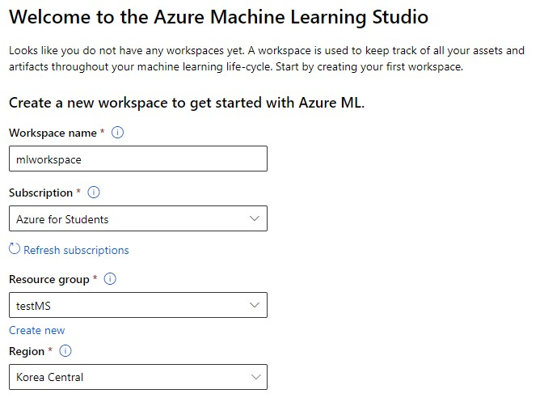

# Clustering with Azure Machine Learning Designer

Azure에서 제공하는 Azure Machine Learning Designer을 통하여 파이프라인을 구축하고 그룹화를 할 수 있다.

요약
1. 작업공간 및 컴퓨팅 생성
2. 파이프라인 생성 및 데이터셋 생성
3. 학습 파이프라인 생성
4. 모델 평가
5. 모델 추론(Inference) 및 배포

참조 링크: [https://microsoftlearning.github.io/AI-900-AIFundamentals/instructions/02c-create-clustering-model.html](https://microsoftlearning.github.io/AI-900-AIFundamentals/instructions/02c-create-clustering-model.html)

## WorkSpace 작업공간 생성



Microsoft Azure Machine Learning Studio에서 작업공간을 만들어준다. 

## 컴퓨팅 생성


* 기계학습을 할 가상 머신을 선택한다.
* cpu와 gpu를 선택할 수 있으며 가벼운 모델을 만들 기 위해 cpu를 생성한다.
* 10GB 이하의 데이터셋을 고성능으로 학습하기 위하여 DS12_v2를 선택한다.

## 파이프라인 생성


* 파이프라인 생성 및 위에서 만든 가상 머신 연결

## 데이터셋 만들기

  

* 팽귄에 대한 데이터셋을 만든다.  

  

* 데이터는 [https://aka.ms/penguin-data](https://aka.ms/penguin-data)으로 부터 받아온다.  

  

* csv 파일을 읽을 설정을 한다.

  

* path 컬럼을 제외하고 나머지 컬럼들로만 데이터셋을 구축한다.

## 데이터 전처리 파이프라인 생성

  

 * __Select Columns in Dataset__ 모듈을 연결한 다음 사용할 컬럼을 선택한다.  
 * _Species_ 를 제외시킨다.


* 모든 열의 결측값을 없앤다.

  

* __Normalize Data__ 모듈을 연결한 후 정규화를 진행한다.
* 정규화 방법은 __MinMax__ 로 진행하며, True 로 선택한 경우 상수 열에 0 사용을 설정한다.
* 모든 열을 정규화한다.

  

* 완성된 파이프라인이며, __mslearn-penguin-training__ 이라는 이름으로 새로운 파이프라인을 제출한다.

## 학습 파이프라인 생성


* __Split Data__ 모듈을 사용하여 train과 test를 나누어 준다.
* 비율은 0.7이고, 랜덤 시드는 123을 준다.


* 그룹화를 할 열들을 고른다.

  

* _Number of centroids_ 를 통하여 몇 개의 그룹으로 나눌지 정한다.


* 완성된 학습 파이프라인이다.
* 기존에 있는 __mslearn-penguin-training__ 으로 제출한다.  

## 모델 평가


* 학습한 모델을 평가하는 것은 __Evaluate Model__ 모듈을 추가하여 확인할 수 있다.
* 자세한 정보는 __Jobs__ 카테고리에서 확인할 수 있다.

## 모델 추론(Inference) 및 모델 배포


* Job에서 __Create inference pipeline__ 으로 __Real-time inference pipeline__ 을 생성한다.
* 그 후, __Settings__ 에서 Draft details을 위와 같이 __Predict Penguin Clusters__ 으로 수정한다.  


* __penguins__ 모듈과 __Select Columns in Dataset__ 모듈을 삭제한다.
* 맨 위에 __Web Service Input__ 모듈과 __Enter Data Manually__ 모듈을 추가한다.
* Enter Data Manually 모듈에는 아래의 데이터를 추가한다.  

```
 CulmenLength,CulmenDepth,FlipperLength,BodyMass
 39.1,18.7,181,3750
 49.1,14.8,220,5150
 46.6,17.8,193,3800
```
* __Evaluate Model__ 모듈을 삭제한다.
* 마지막으로 __mslearn-penguin-inference__ 으로 새롭게 제출한다.

  

* __mslearn-penguin-inference__ 를 위와같이 배포한다.  


* 배포가 끝나면 test 카테고리를 클릭하여 위와 같이 테스트를 할 수 있다.

```json
 {
     "Inputs": {
         "input1": [
             {
                 "CulmenLength": 49.1,
                 "CulmenDepth": 4.8,
                 "FlipperLength": 1220,
                 "BodyMass": 5150
             }
         ]
     },
     "GlobalParameters":  {}
 }
```

