# Regression with Azure Machine Learning Designer

Azure에서 제공하는 Azure Machine Learning Designer을 통하여 파이프라인을 구축하고 회귀분석을 할 수 있다.

요약  
1. 작업공간 및 컴퓨팅 생성
2. 전처리 파이프라인 생성
3. 학습 파이프라인 생성
4. 모델 평가
5. 모델 추론(Inference) 및 배포

참조 링크: [https://microsoftlearning.github.io/AI-900-AIFundamentals/instructions/02a-create-regression-model.html](https://microsoftlearning.github.io/AI-900-AIFundamentals/instructions/02a-create-regression-model.html)

## WorkSpace 작업공간 생성

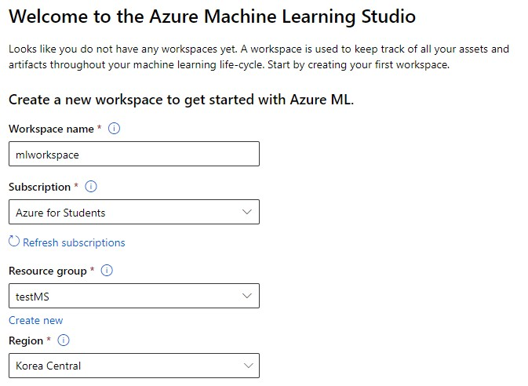

Microsoft Azure Machine Learning Studio에서 작업공간을 만들어준다. 

## 컴퓨팅 생성

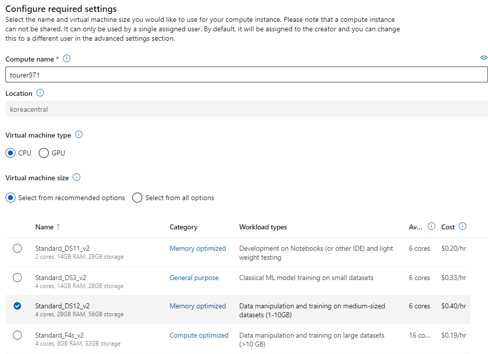

* 기계학습을 할 가상 머신을 선택한다.
* cpu와 gpu를 선택할 수 있으며 가벼운 모델을 만들 기 위해 cpu를 생성한다.
* 10GB 이하의 데이터셋을 고성능으로 학습하기 위하여 DS12_v2를 선택한다.

## Designer에서 전처리 파이프라인 생성

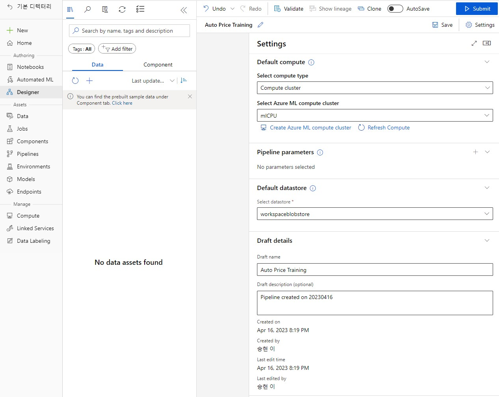  

* 상단에 __Settings__ 를 클릭하여 파이프라인에서 사용할 가상 머신을 설정한다.

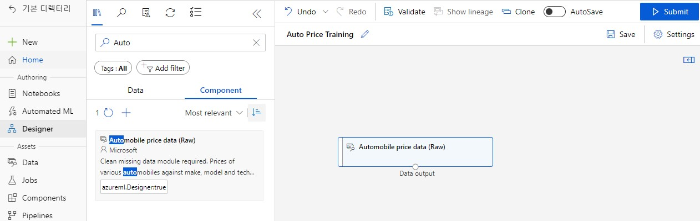

* Designer에서는 검색창에 원하는 작업을 검색한 후 작업 공간에 가져와서 작업한다.
* 맨 처음 데이터가 없으니 샘플 데이터를 가져온다.  (_Automobile price data (Raw)_)  

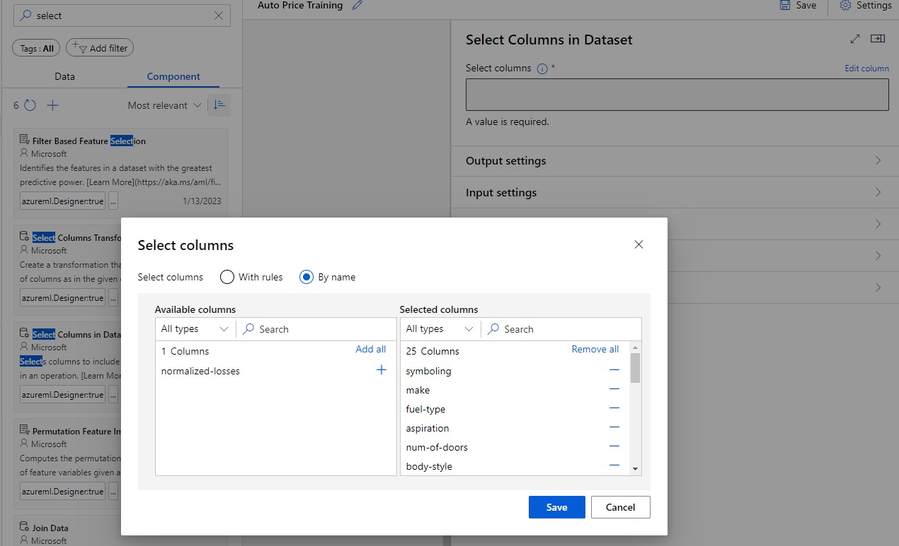

* 각각의 모듈을 선으로 이은 후, 더블 클릭하여 작업 창에 들어와서 __Edit column__ 을 설정한다.  
* 작업할 열을 가져온다.

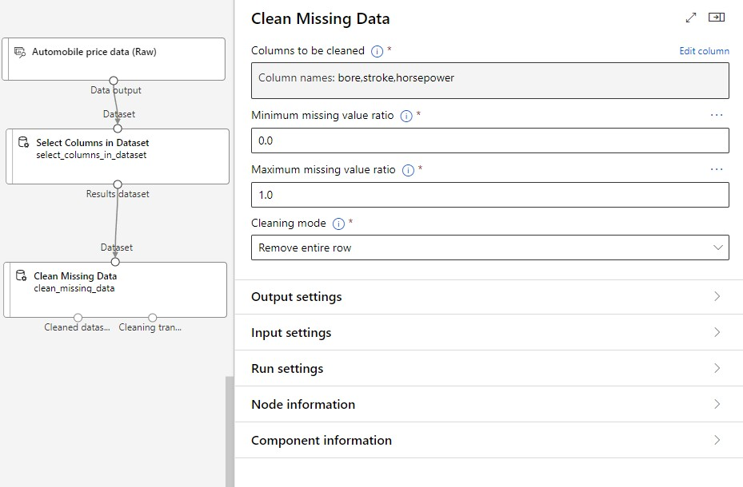

* 결측값을 없앨 열을 선택한다.

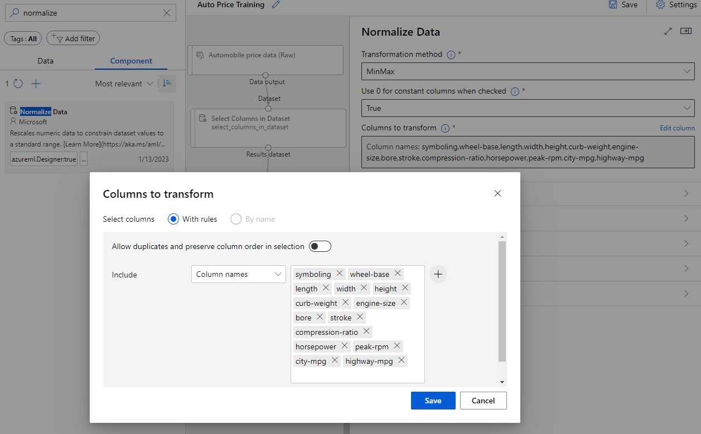

* 정규화를 진행할 열을 선택한다.

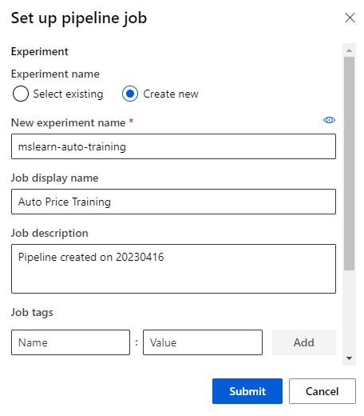

* 마지막으로 설정이 다 끝났으면 __submit__ 버튼을 클릭하여 전처리 파이프라인을 생성한다.

## 학습 파이프라인 생성

 

기존에 있는 전처리 파이프라인에 연결하여서 구축하는게 포인트이다.

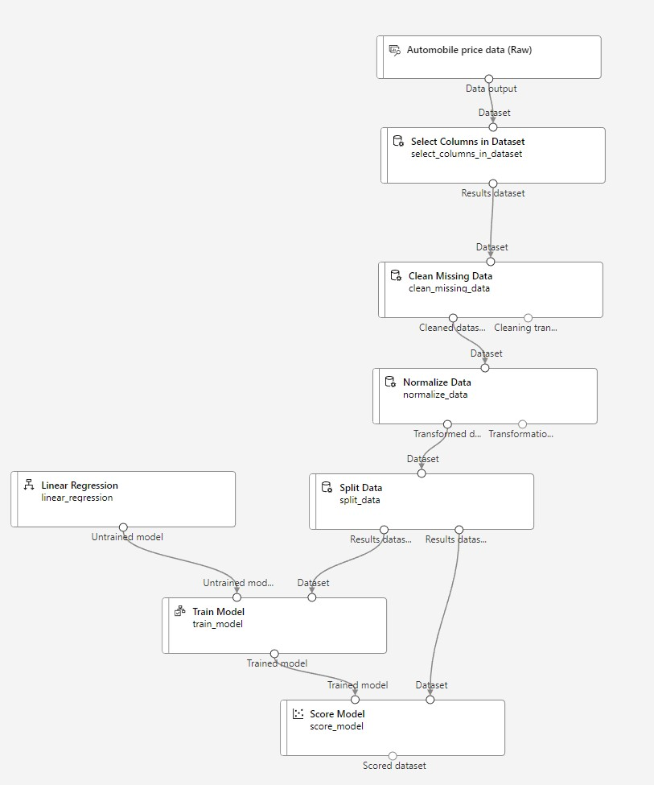

* split data를 통하여 dataset을 train과 test로 나누어 준다.
* 학습 방법을 선택한다. (_Linear Regression_)
* Score model을 통하여 정확도(acc)를 평가한다.
* 새로운 파이프라인을 구성하였으면 __Submit__ 버튼을 눌러서 업데이트한다.

## 모델 평가

카테고리에서 __Jobs__ 에 들어가면 학습 결과를 알 수 있다.

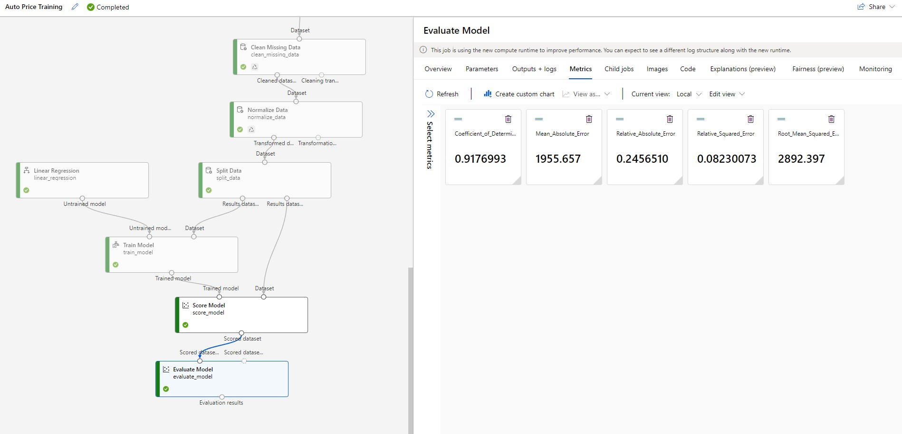

* __Evaluate model__ 모듈을 하나 더 추가한다면 위와 같은 모델 평가가 가능하다.

## 모델 추론(Inference) 및 모델 배포

 

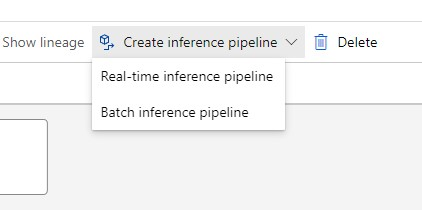

* 먼저 인퍼런스 파이프라인을 새로 만들어야 한다.  
* endpoint 방식으로 하기 때문에 Real-time으로 선택한다.

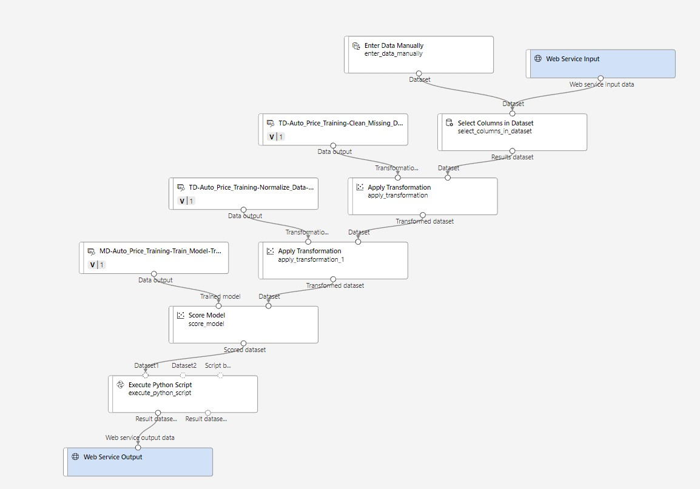

* 여기 파트는 조금 복잡하여 페이지 맨 위에 올려놓은 링크를 참조하자.  
* 내용을 조금 요약하자면 추론이기 때문에 기존에 있는 불필요한 train 데이터를 없애고 학습할 때는 필요했던 label값 열을 이제는 필요없기 때문에 설정에서 지우는 등에 대한 내용이다.

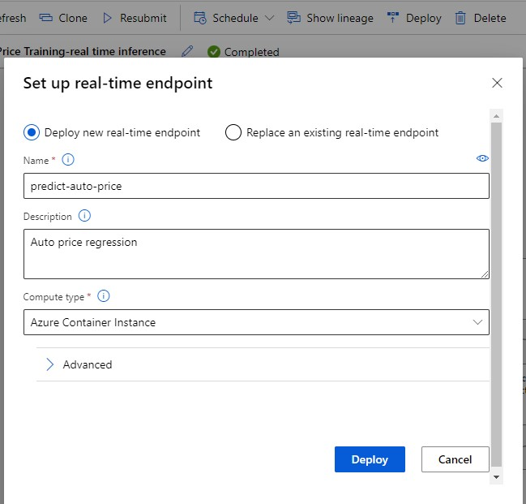

* 모든 모델이 정상적으로 끝나면 상단 옵션 바에 __deploy__ 가 생성된다.
* 따라서 그 후 배포하여 주면 endpoint가 생성된다.
* __Operation state__ 를 꼭 확인해라. 배포 시간이 되게 오래 걸린다.

## Test

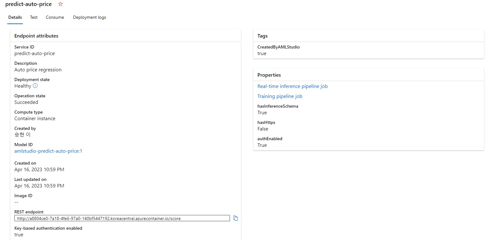

* endpoint를 발급 받은 모습을 볼 수 있다.
* 여기서 상단에 Test 태그를 통하여 동작하는지 테스트하여 본다.

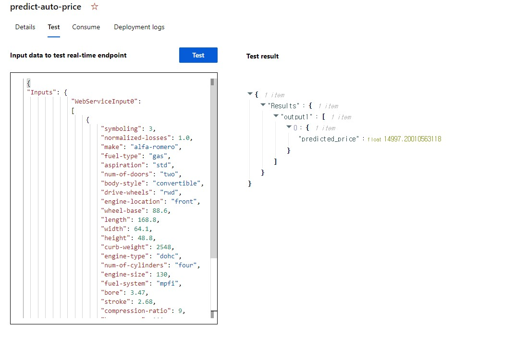

위와 같이 성공한 모습을 볼 수 있다.