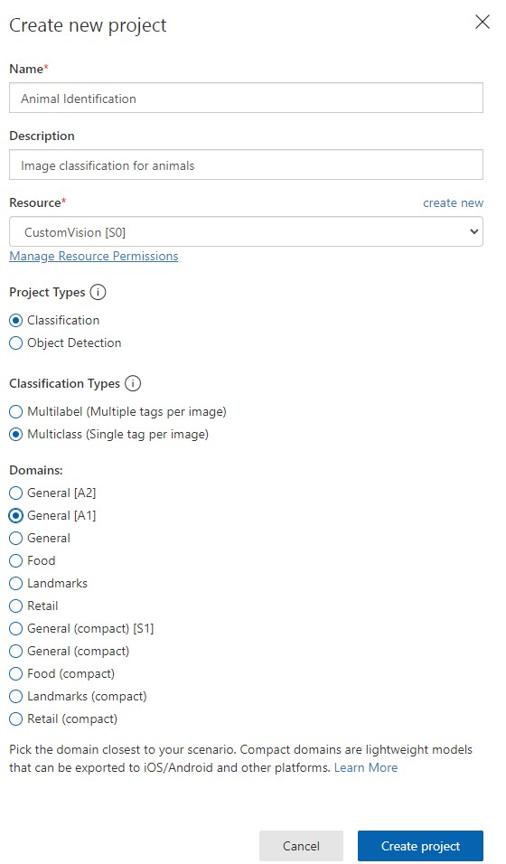

# Image Classification

Azure에서 제공하는 이미지 분류 서비스

참조 링크: [https://microsoftlearning.github.io/AI-900-AIFundamentals/instructions/03a-classify-images.html](https://microsoftlearning.github.io/AI-900-AIFundamentals/instructions/03a-classify-images.html)

## 요약

1. Cognitive 리소스 만들기
2. CustomVison 리소스 및 프로젝트 생성
3. 이미지 라벨링
4. 모델 학습 및 배포
5. 이미지 분류

## Cognitive Services 리소스 만들기


발급 받은 학생 구독을 사용하여 리소스 그룹에 프로젝트를 추가한다.

# Custom Vision 프로젝트 만들기

링크: [https://www.customvision.ai/projects](https://www.customvision.ai/projects)


프로젝트 생성 전 CustomVision에서 리소스 만들기 



프로젝트 생성하기 및 [https://aka.ms/animal-images](https://aka.ms/animal-images) 에 들어가서 이미지 다운로드 받기  
<br>
다운 받은 이미지는 로컬환경에서 압축을 해제한다.


코끼리, 사자, 기린 이미지를 각각 업로드하여 라벨링하여 준다.

## 모델 학습


빠르게 모델 학습에 들어간다.

## 모델 배포

  

__Publish__ 버튼을 클릭하여 모델을 배포한다.  
모델을 배포하면 위와 같이 url을 받을 수 있다.

## 이미지 분류


위에서 발급 받은 API의 URL과 Key 값을 __classify-image.ps1__ 파일에 입력하여 준다.  


```bash
./classify-image.ps1 1
./classify-image.ps1 2
./classify-image.ps1 3
```

Azure powershell에 위에 명령어를 입력하여 __classify-image.ps1__ 이미지를 분석하여 결과를 출력하여 준다.


