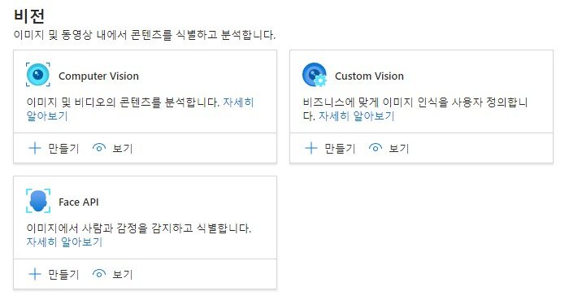
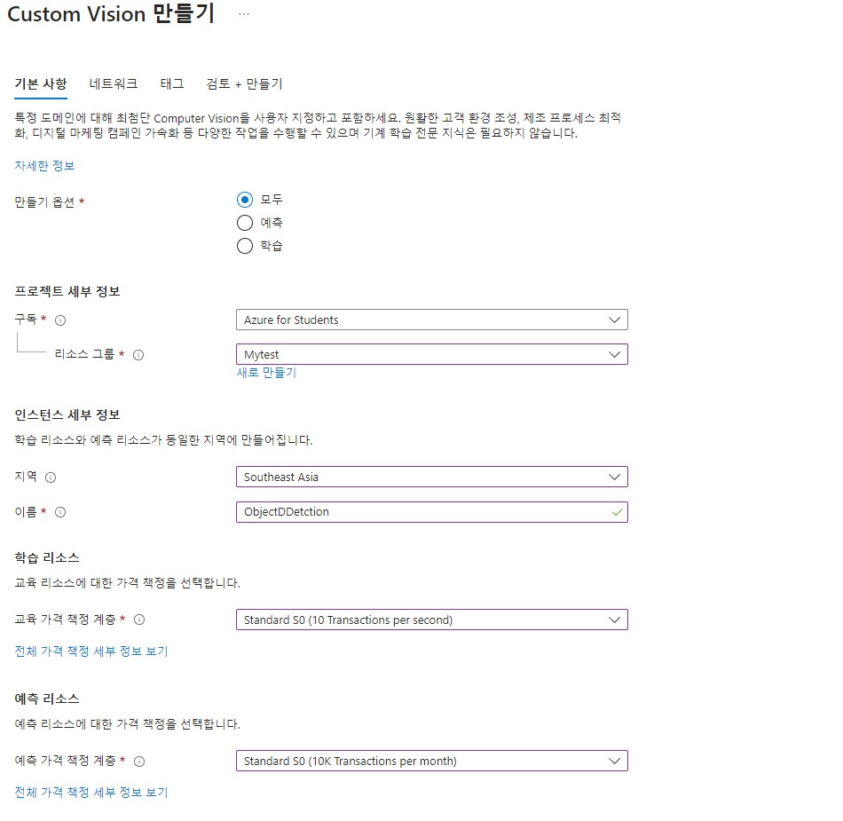
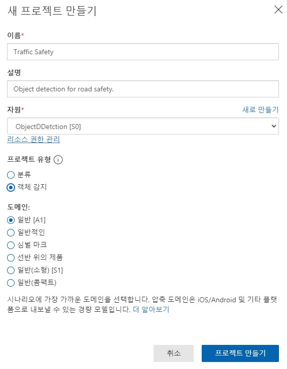
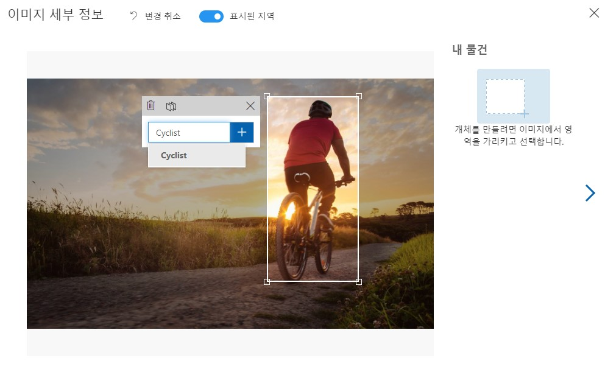
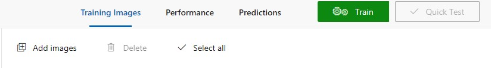
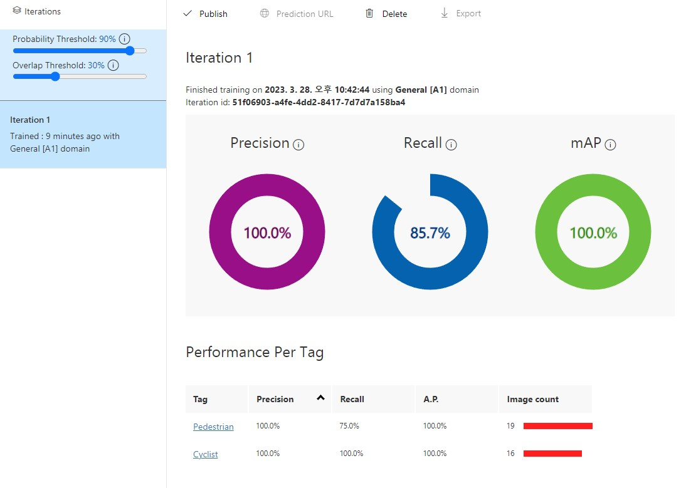
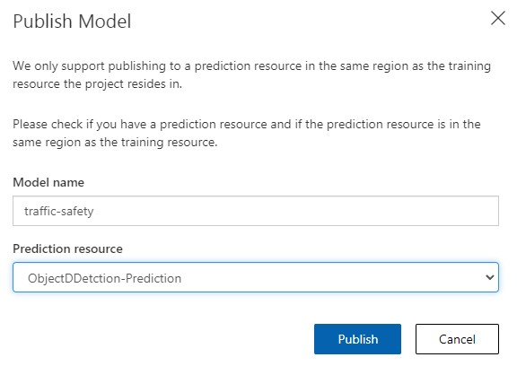
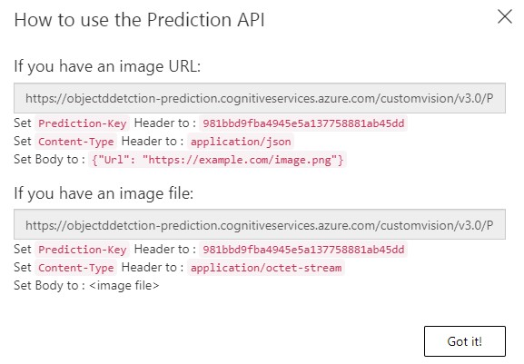
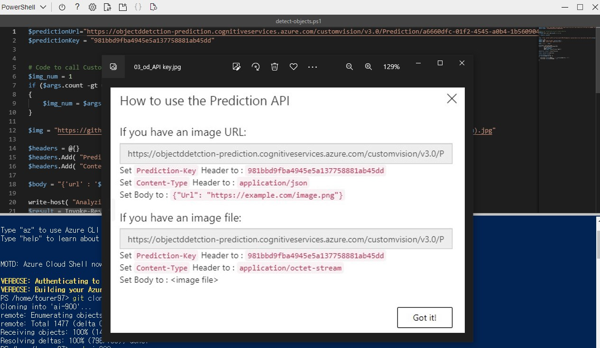
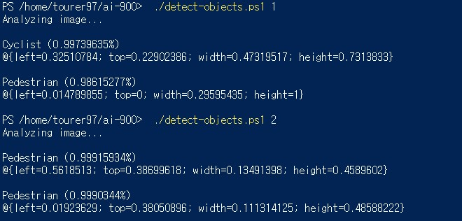

# Object Detection
Azure에서 제공하는 개체 감지 실습

참고 링크: [https://microsoftlearning.github.io/AI-900-AIFundamentals/instructions/03b-create-object-detection-solution.html](https://microsoftlearning.github.io/AI-900-AIFundamentals/instructions/03b-create-object-detection-solution.html)

# Cognitive Services 리소스 만들기


먼저 custom 비전을 만든다.



위와 같이 설정한다.

# Custom Vision 프로젝트 만들기

링크: [https://www.customvision.ai/projects](https://www.customvision.ai/projects)



위와 같이 새로운 프로젝트를 생성한다. 생성한 후 아래의 링크에서 이미지를 다운 받는다.  
링크: [https://aka.ms/traffic-images](https://aka.ms/traffic-images)



위와 같이 사진들을 Cyclist와 Pedestrian으로 2개 의 라벨으로 수작업으로 라벨링을 진행한다.



라벨링이 끝나게 되면 학습 버튼을 누른 후 학습 모델을 결정한다.  
그 후 맨 하단에 get Started 버튼을 눌러서 학습에 들어가게 한다.



나온 결과를 확인한다.

# 모델 배포하기



상단에 publish 버튼을 클릭하여 위와 같이 설정하여 모델을 배포한다.



모델 배포 후 옆에 있는 Prediction URL을 통하여 API url를 받는다.

# 클라이언트에서 모델 사용하기

먼저 Azure에 있는 Powershell에 접속한다. (없을 경우 구독을 사용하여 자동으로 만든다.)

```
rm -r ai-900 -f
 git clone https://github.com/MicrosoftLearning/AI-900-AIFundamentals ai-900
```
그 후 AI-900 저장소를 clone한다.

```
cd ai-900
code detect-objects.ps1
```

으로 폴더에 접근 후 코드 창을 연다.



아까 customvision 프러젝트에서 만들었던 Url과 key 값을 입력한 후 __CTRL+S__ 를 눌러 저장한 후, __CTRL+Q__를 눌러 코드 편집기를 닫는다.  

```
./detect-objects.ps1 1
./detect-objects.ps1 2
```

2가지 파일을 powershell에 입력하여 테스트하여 본다.



위와 같은 결과가 나온다면 성공이다.