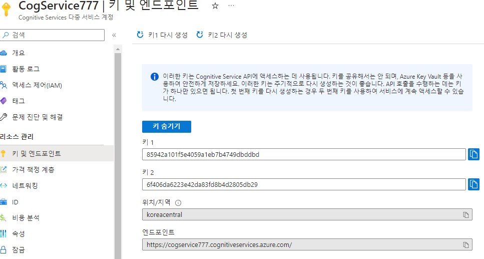
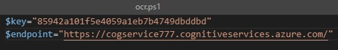
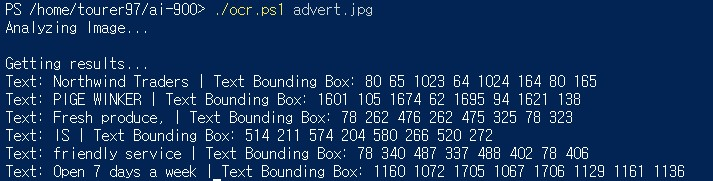

# OCR(Optical Character Recognition)

Azure에서 제공하는 광학 문자 인식 서비스  
OCR은 이미지에서 텍스트를 감지하고 해석하는 것을 뜻한다. 

## 요약
1. Cognitive 리소스 만들기
2. key && endpoint 발급
3. 이미지에서 텍스트 검출 및 바운딩 박스 출력

## Cognitive Services 리소스 만들기


발급 받은 학생 구독을 사용하여 리소스 그룹에 프로젝트를 추가한다.

## 리소스 관리



발급 받은 키와 엔드포인트를 확인할 수 있다.

## ai-900 저장소 clone

```bash
 git clone https://github.com/MicrosoftLearning/AI-900-AIFundamentals ai-900
 code .
```
샘플 코드를 깃으로 내려받은 후 __ocr.ps1__ 파일을 오픈한다.  

## Cognitive Services key와 endpoint 입력



## powershell 실행

먼저 이미지를 살펴 보겠다.


```bash
./ocr.ps1 advert.jpg
```

Azure powershell에 위에 명령어를 입력하여 이미지 파일을 분석하여 텍스트 검출 및 위치(바운딩 박스)를 츨력하여 준다. 




위에 바운딩 박스 정보를 이미지에서 나타내게 되면 아래와 같이 출력된다.

