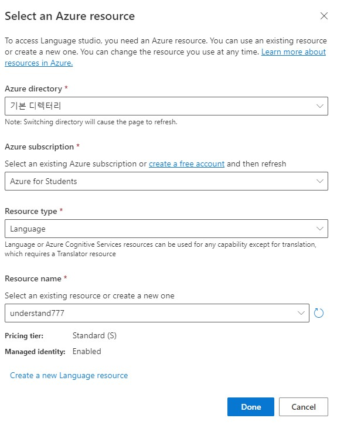
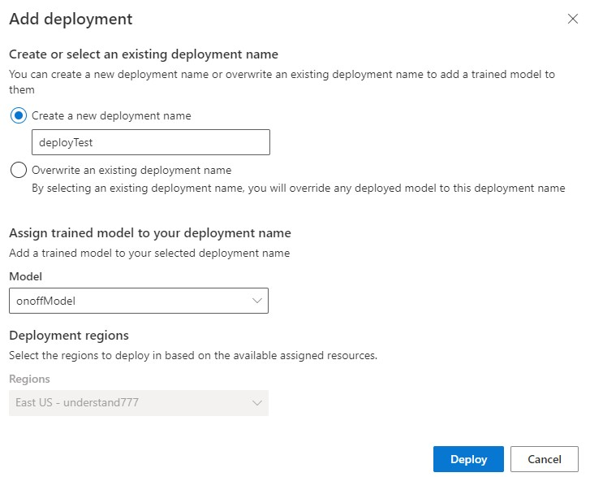

# Language Understanding

Azure에서 제공하는 언어 이해 서비스이다.  
AI가 사용자가 원하는 텍스트를 이해하고 알맞게 동작한다.

요약
1. Language Service 리소스 만들기
2. 애플리케이션 만들기
3. 모델 학습 및 앱 배포
4. 

참조 링크: [https://microsoftlearning.github.io/AI-900-AIFundamentals/instructions/04c-conversational-language-understanding.html](https://microsoftlearning.github.io/AI-900-AIFundamentals/instructions/04c-conversational-language-understanding.html)

## Language Service 리소스 만들기

위와 같이 언어 서비스 리소스를 만들어준다.  

## 애플리케이션 만들기

언어 인지에 사용할 애플리케이션은 [https://language.azure.com/?azure-portal=true](https://language.azure.com/?azure-portal=true) 에서 만들 수 있다.

* 먼저 기본적인 workspace를 만든다.

* 새로운 프로젝트를 만든다.
* __Conversational language understanding__ 을 선택한다.

* 언어 이해에서 제일 중요한 동작 intent를 추가한다.  

* 하단에 보이는 __Utterance__ 에서 예상되는 구문을 저장한다.
* 오른쪽 면에 Activity pane에서 특정 물체의 라벨을 정한다.

* 예상 구문의 인탠트를 직접 라벨링하여 준다.  

## 모델 학습

  

* 모델을 만들어주고 학습시켜 준다.

## 앱 배포

 

* 학습이 끝났다면 앱을 배포하여 준다.