# Question Answering

Azure에서 제공하는 챗봇 서비스이다.

요약  
1. 언어 서비스 리소스 생성
2. 질문 추가 및 테스트
3. 챗봇 생성


참조 링크: [https://microsoftlearning.github.io/AI-900-AIFundamentals/instructions/04d-create-a-bot.html](https://microsoftlearning.github.io/AI-900-AIFundamentals/instructions/04d-create-a-bot.html)

## 언어 서비스 리소스

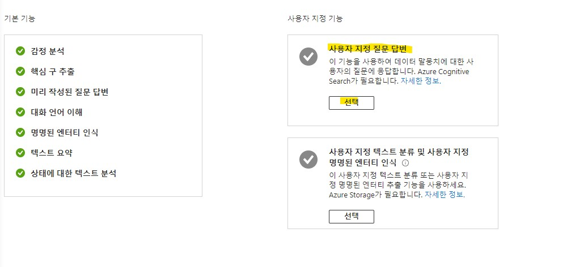

* 리소스를 생성할 때, 사용자 지정 질문 답변을 선택하여 생성한다.

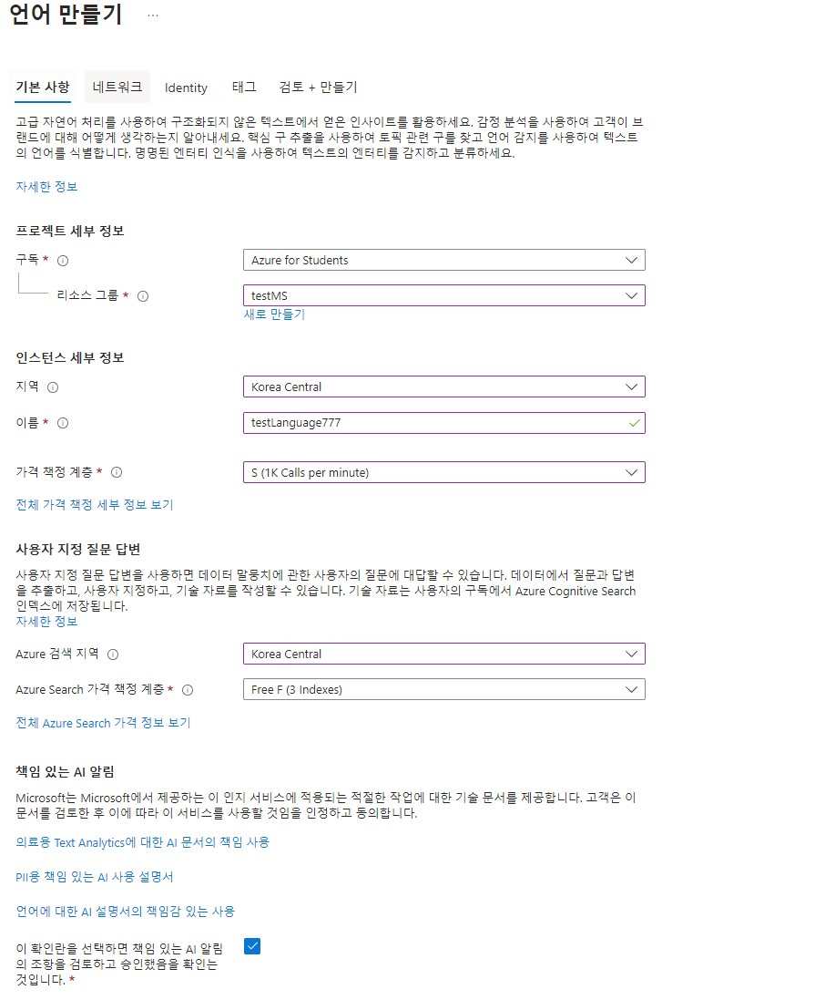

* 나머지는 위와 같이 설정하여 준다.

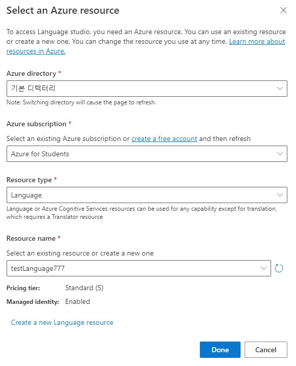

* [https://language.cognitive.azure.com/?azure-portal=true](https://language.cognitive.azure.com/?azure-portal=true) 에 접속하여 작업환경을 만들기 위해 애저 포털에서 만든 리소스와 연동하여 리소스를 만든다.

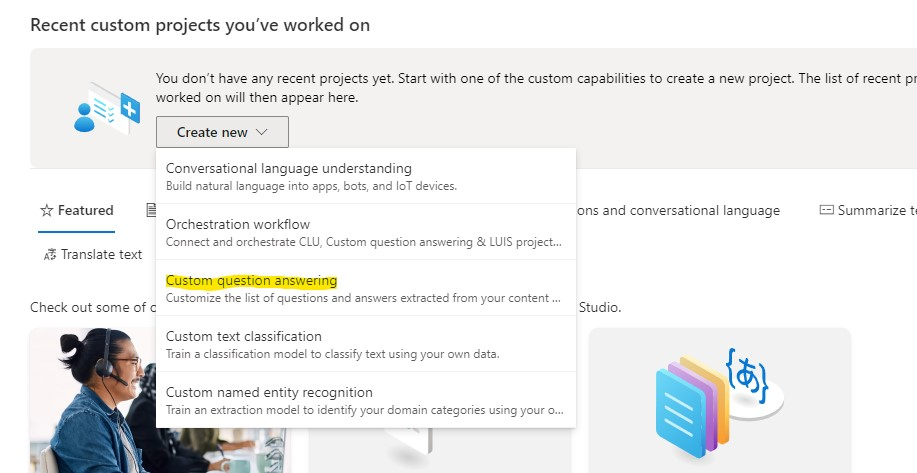

* __Custom question answering__ 을 선택하여 작업환경(workspace)를 만든다.

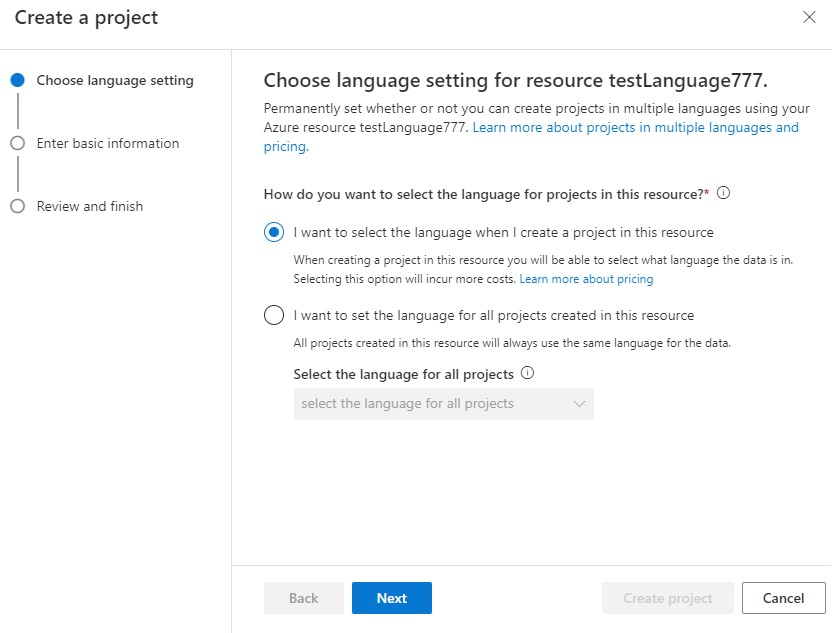

* 첫 번째 것을 선택한다.

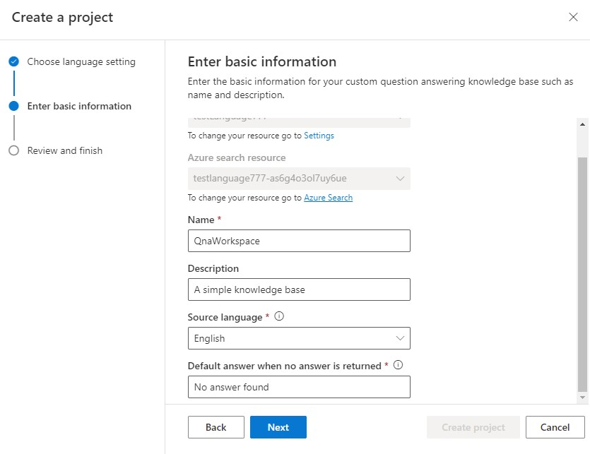

* 위와 같이 설정하여 작업환경을 생성한다.

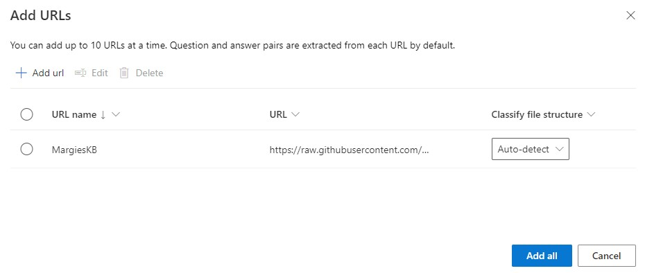

* 마지막으로 __add source__ 에서 URL을 사용하여 FAQ 질문을 추가하여 준다.
* __URL__ 이름: MargiesKB
* __URL__: https://raw.githubusercontent.com/MicrosoftLearning/AI-900-AIFundamentals/main/data/qna/margies_faq.docx 

## 질문 추가 및 테스트

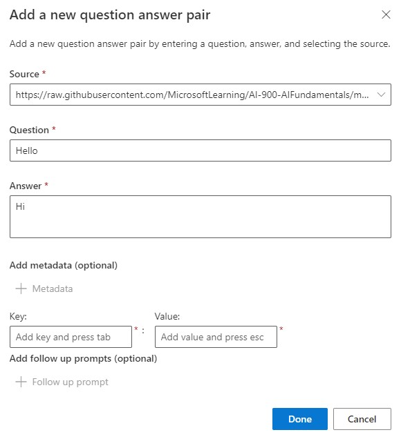

* 질문 추가를 테스트해보기 위하여 __+ Add question pair__ 에서 질문에 Hello와 답변에 Hi를 추가한다.

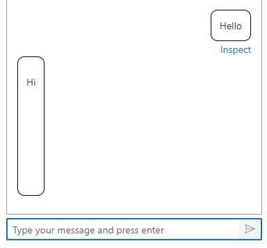

* 상단에 __Test__ 버튼을 클릭하여 위에 추가한 질문을 질문하여보고 답변을 반환받아 본다.

## 챗봇 생성

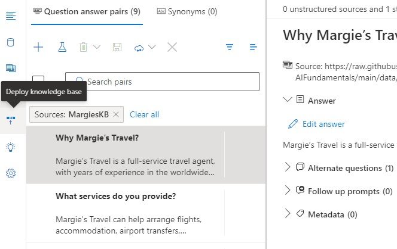

* __deploy__ 를 선택하여 배포를 한 후, 챗봇을 생성을 클릭한다.

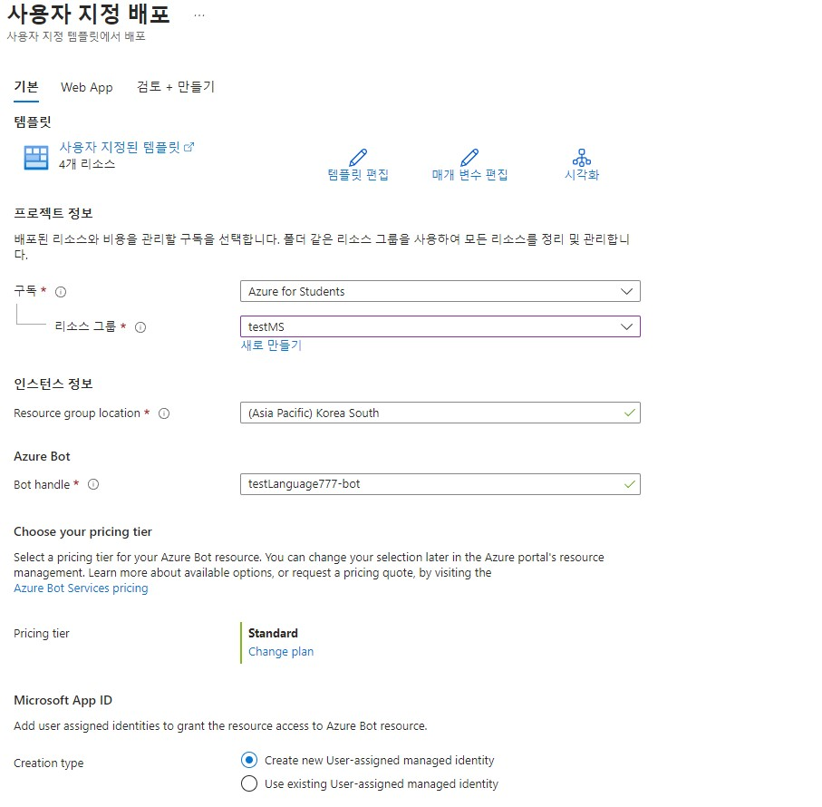

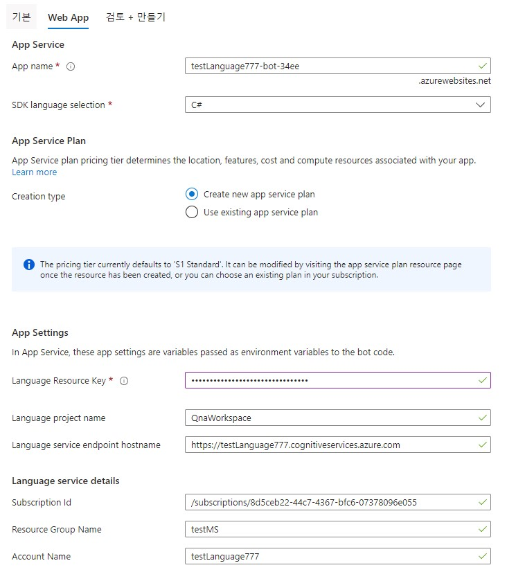

* 위와 같이 설정하여 챗봇을 생성한다.

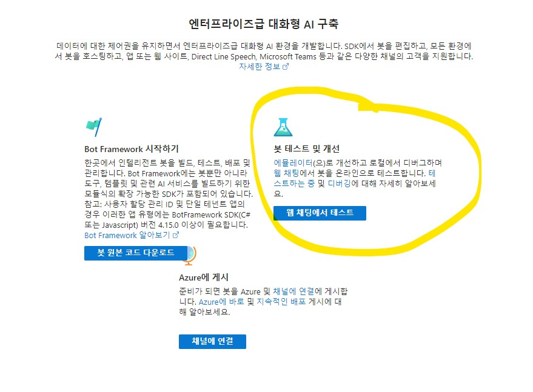

* 챗봇 생성에 성공한 후, 챗봇 리소스에 접속하여 __웹 채팅에서 테스트__ 를 클릭한다.

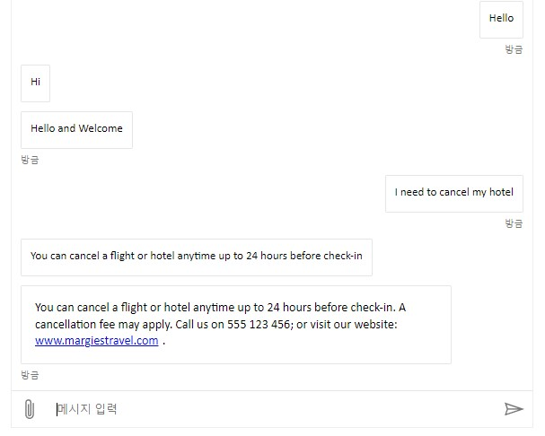

```
Hi
I need to cancel my hotel
```

* 마지막으로 위에 텍스트를 전송하여 챗봇이 정상적으로 작동하는지 테스트한다.