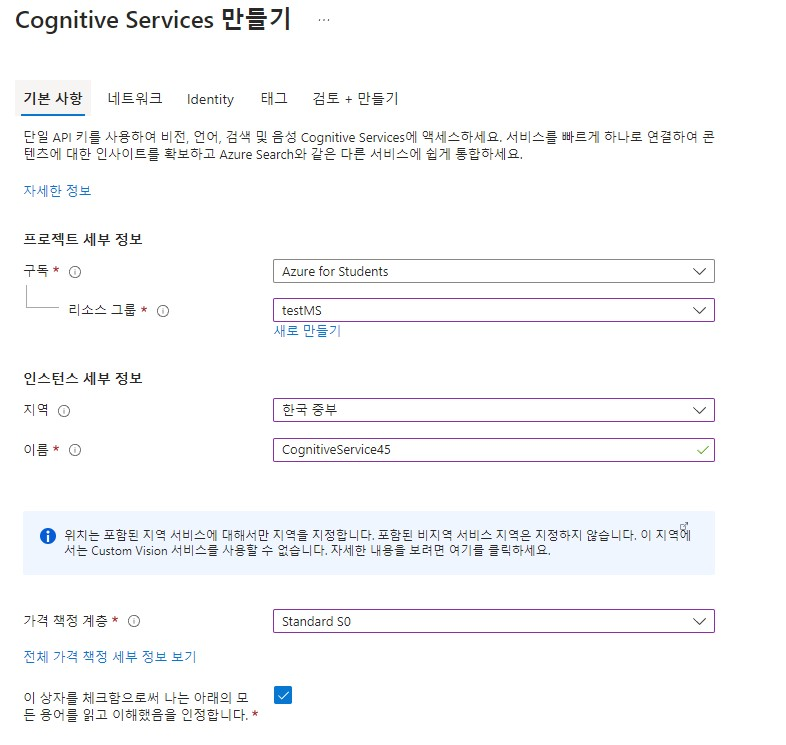
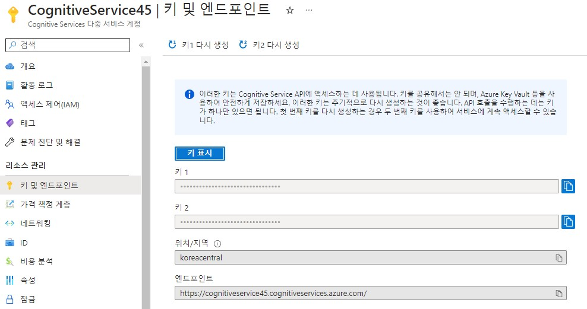
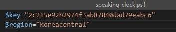
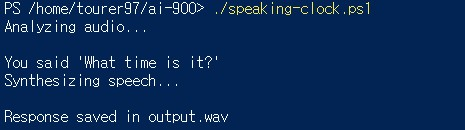

# Speech

Azure에서 제공하는 음성 인식 후 텍스트 변환 서비스

## 요약
1. Cognitive 리소스 만들기
2. key && endpoint 발급
3. 음성 인식 및 텍스트 변환

참조 링크: [https://microsoftlearning.github.io/AI-900-AIFundamentals/instructions/04a-recognize-synthesize-speech.html](https://microsoftlearning.github.io/AI-900-AIFundamentals/instructions/04a-recognize-synthesize-speech.html)

## Cognitive Services 리소스 만들기



발급 받은 학생 구독을 사용하여 리소스 그룹에 프로젝트를 추가한다.

## 리소스 관리



발급 받은 키와 엔드포인트를 확인할 수 있다.

## ai-900 저장소 clone

```bash
 git clone https://github.com/MicrosoftLearning/AI-900-AIFundamentals ai-900
 code .
```
샘플 코드를 깃으로 내려받은 후 __speaking-clock.ps1__ 파일을 오픈한다.

## Cognitive Services key와 endpoint 입력

  


## powershell 실행



```bash
./speaking-clock.ps1
```

Azure powershell에 위에 명령어를 입력하여 미리 저장된 음성 파일인 __time.wav__ 를 전송하여 음성 인식 후 텍스트를 검출하여 반환한 뒤, 대답으로 가능한 대답을 음성파일로 반환한다.