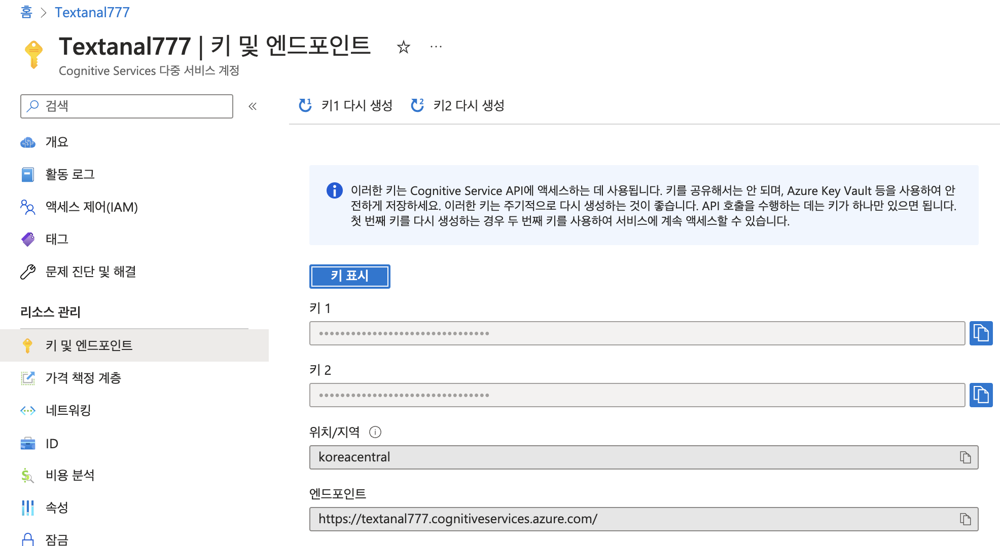
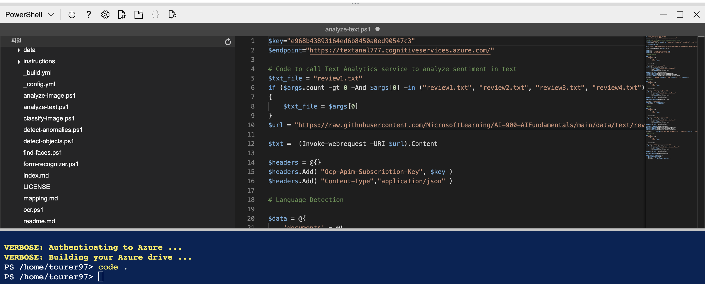
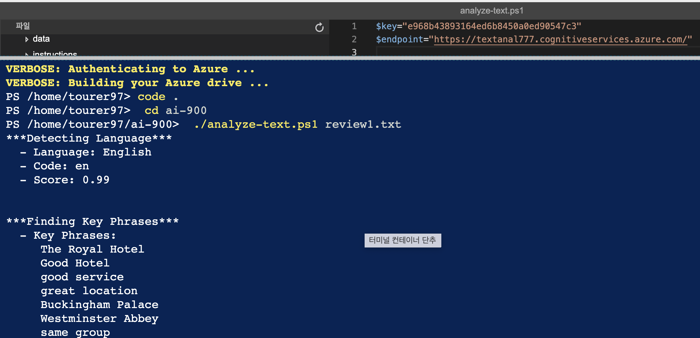

# Text Analysis

Azure에서 제공하는 텍스트 분석 실습

참조 링크: [https://microsoftlearning.github.io/AI-900-AIFundamentals/instructions/04-module-04.html](https://microsoftlearning.github.io/AI-900-AIFundamentals/instructions/04-module-04.html)

## 요약
1. Cognitive 리소스 만들기
2. key && endpoint 발급
3. 텍스트 분석

참조 링크: [https://microsoftlearning.github.io/AI-900-AIFundamentals/instructions/04-module-04.html](https://microsoftlearning.github.io/AI-900-AIFundamentals/instructions/04-module-04.html)

## Cognitive Services 리소스 만들기


발급 받은 학생 구독을 사용하여 리소스 그룹에 프로젝트를 추가한다.

## 리소스 관리



발급 받은 키와 엔드포인트를 확인할 수 있다.

## ai-900 저장소 clone

```bash
 git clone https://github.com/MicrosoftLearning/AI-900-AIFundamentals ai-900
 code .
```
샘플 코드를 깃으로 내려받은 후 __analyze-text.ps1__ 파일을 오픈한다.

## Cognitive Services key와 endpoint 입력



## powershell 실행



```bash
./analyze-text.ps1 review1.txt
```

Azure powershell에 위에 명령어를 입력하여 __review1.txt__ 파일을 분석하여 결과를 출력하여 준다.