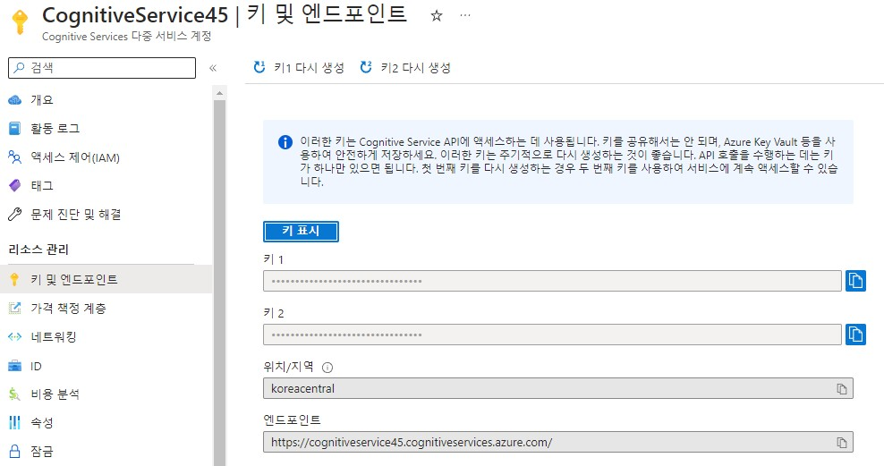

# Translation

Azure에서 제공하는 번역 서비스

## 요약
1. Cognitive 리소스 만들기
2. key && location 입력
3. 번역

참조 링크: [https://microsoftlearning.github.io/AI-900-AIFundamentals/instructions/04b-translate-text-and-speech.html](https://microsoftlearning.github.io/AI-900-AIFundamentals/instructions/04b-translate-text-and-speech.html)

## Cognitive Services 리소스 만들기


발급 받은 학생 구독을 사용하여 리소스 그룹에 프로젝트를 추가한다.

## 리소스 관리



발급 받은 키와 엔드포인트를 확인할 수 있다.

## ai-900 저장소 clone

```bash
 git clone https://github.com/MicrosoftLearning/AI-900-AIFundamentals ai-900
 code .
```
샘플 코드를 깃으로 내려받은 후 __translate.ps1__ 파일을 오픈한다.

## Cognitive Services key와 location 입력

  

## powershell 실행


```bash
 ./translator.ps1
```

Azure powershell에 위에 명령어를 입력하면 원하는 언어로 번역한 텍스트를 반환하며 오디오 파일에서 나온 음성도 번역하여 텍스트를 반환하는 것을 볼 수 있다.