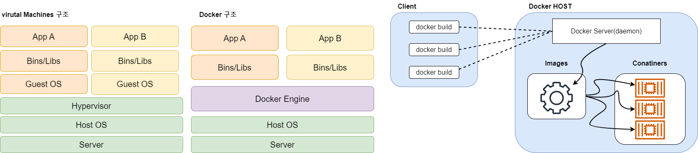
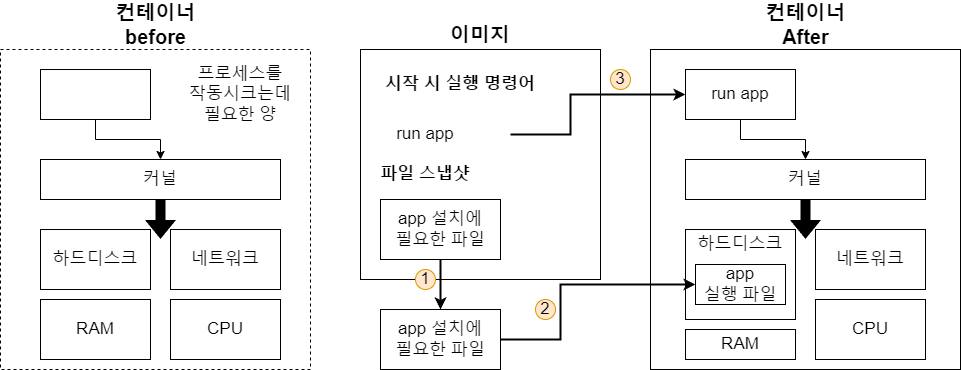

# Docker란?

* Docker를 사용하면 환경에 구애받지 않고 애플리케이션을 신속하게 배포 및 확장할 수 있으며 코드가 문제없이 실행을 가능하게 하는 소프트웨어이다. 
* 기존에 있는 VM의 개념에서 제일 큰 차이점은 아래와 같이 Guest OS를 설치하지 않아 신속하고 빠르게 배포할 수 있다는 점이다.



## Docker Images
* 코드, 런타임, 시스템 도구, 시스템 라이브러리 및 설정과 같은 응용 프로그램
을 실행하는 데 필요한 모든 것을 포함하는 가볍고 독립적이며 실행 가능한 소프트웨어 패키지이다. 
* 좀 더 쉽게 설명하자면 앱을 실행하기 위한 환경설정과 같다. 따라서 버전관리가 쉽다
* 아나콘다의 가상환경을 생각하면 조금 더 이해가 쉬울 것이다.

## Docker Conatiner
* 코드와 모든 종속성을 패키지화하여 응용 프로그램이
한 컴퓨팅 환경에서 다른 컴퓨팅 환경으로 빠르고 안정적으로 실행되도록 하는
소프트웨어의 표준 단위이다.  
* 요약하면 Images의 환경을 바탕으로 동작하는 인스턴스이며, 프로그램을 실질적으로 실행한다.

# Image로 Conatiner 동작
## Image

1. Docker client(CMD창)에서 __docker run <이미지>__ 를 입력한다.
2. Docker image에 있는 파일 스냅샷을 컨테이너 하드 디스크에 옮겨서 동작한다.
* 파일 스냅샷은 디렉토리나 파일을 카피한 것
3. 이미지에서 가지고 있는 명령어(컨테이너가 실행될때 사용될 명령어)를 이용해서 app을 실행시킨다.

## Container



1. app 설치에 필요한 파일(환경)을 하드디스크 위에 올린다.
2. 설치가 완료된 후 app을 동작한다.
3. Docker Client에서 입력한 명령어를 실행한다.

### 맛 보기) Docker를 사용하여 python 파일 실행하기

```bash
$ docker pull python
```
1. 파이썬 이미지를 도커허브에서 내려받는다.

```py
# 현재 파일 경로  I:\TIL\test.py
print("hello world!")
```
2. 파이썬 파일을 작성 후 저장한다.

```bash
$ docker run -it --rm -v I:\TIL:/app python python /app/test.py
```

3. docker 컨테이너를 동작하여 test.py를 읽은 후 

```bash
$ docker run -it --rm -v [절대 경로]:/app python python app/[경로 안에 있는 파일]
```
* 요약해서 좀 더 쉽게 설명하자면 절대경로 안에 있는 필요한 파일들을 파일 스냅샷으로 컨테이너 내부에 있는 __/app__ 밑으로 옮긴 것을 볼 수 있다. 
* 그 후 __python app/[파일명]__ 을 통하여 기존에 cmd에서 파이썬 실행하는 법과 동일하게 파일을 실행하는 것이다.


## Docker login

dockerhub 아이디와 비밀번호를 통하여 도커에 로그인 할 수 있다.

```bash
$ docker login
```