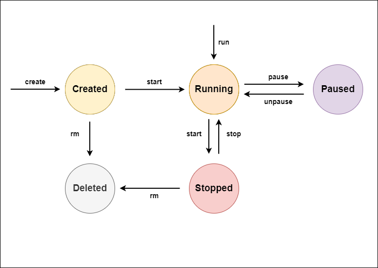

# Docker Container LifeCycle




## 컨테이너 상태 확인

```bash
$ docker ps
```
*  실행중인 컨테이너 상태 확인

```bash
$ docker ps -a
```

* 전체 컨테이너 상태 확인

```bash
$ docker inspect [컨테이너명]
```

* 컨테이너 상세정보 확인

<br>

# 컨테이너 명령어

## 컨테이너 실행

```
$ docker run [옵션] [컨테이너명]
```

* 옵션
    * __-i__ : 호스트의 표준 입력을 컨테이너 입력(STDIN)에 연결하는 옵션이다.
    * __-t__ : 가상터미널(TTY)를 할당하는 명령어로 _-i_ 옵션과 주로 같이 사용하여 -it 옵션으로 사용한다.
        * 만약 -it를 입력 못하고 컨테이너를 실행하였을 경우 __docker exec -it__ 를 사용한다.
    * __--name [컨테이너명]__ : 컨테이너 이름을 설정한다.
    * __-d__ : 컨테이너를 백그라운드 프로세스로 실행하는 옵션이다.
    * __-rm__ : 컨테이너를 종료할 경우, 컨테이너를 자동 삭제하는 옵션이다.
    * __-p__ : 호스트와 컨테이너 포트를 연결하는 옵션
        * __docker run -p 8123:80 ubuntu__ 를 입력하면 호스트 pc의 8123포트를 컨테이너의 80포트와 연결하여 준다.
    * __-v__ : 

## 컨테이너 종료

```bash
$ docker stop [컨테이너명]
```

* 컨테이너 종료 (SIGTERM 시그널 전달)

```bash
$ docker kill [컨테이너명]
```

* 컨테이너 강제 종료 (SIGKILL 시그절 전달)

```bash
$ docker stop $ (docker ps -a -q)
```

* 모든 컨테이너 종료 (-q는 ID만 출력되게 된다.)

## 컨테이너 삭제

```bash
$ docker rm [컨테이너명]
```

* 컨테이너 삭제(실행중인 컨테이너 삭제 불가)

```bash
$ docker rm -f [컨테이너명]
```

* 컨이너 강제 종료 후 삭제 (SIGKILL 시그널 전달)

```bash
$ docker run --rm [~생략~]
```

* 컨테이너 실행 종료 후 자동 삭제

```bash
$ docker container prune
```

* 중지된 모든 컨테이너 삭제