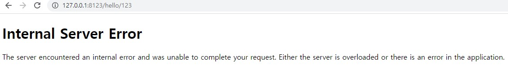

# Flask 설치 및 객체

```py
!pip install flask
from flask import Flask

app = Flask(__name__)
app
```

Flask 객체 안에 이름을 저장해주는 것으로 인스터스 가능하다.  
주로 안에 이름은 __ main __ 을 사용하는데 다른 이름도 가능하나 특정 기능에서 동작 안하는 경우가 있다.

## Web Server와 WAS
* 웹서버는 정적인 HTML 페이지를 반환한다.
  - 요청에 따른 정적인 데이터를 반환한다.
* 웹서버가 동적으로 데이터를 반환하도록 하기 위해서는, WAS 프레임워크가 필요하다.
  - 주요 WAS 프레임워크로는 flask, django, rails, node.js 등이 있다.
  - flask는 app.run() 함수로 자체 웹서버 구현이 가능하다.

# 기본적인 전체 코드

```py
from flask import Flask

app = Flask(__name__)

@app.route("/")
def test1():                           
    return "Server Open!!"

@app.route("/hello")
def test2():                           
    return "Hello Flask!"

if __name__ == "__main__":              
    app.run(host="127.0.0.1", port="8123")
```

## 라우팅

입력받은 주소를 목적지에 찾아주는 기능이다.  
URL을 해당하는 URL에 연결하여 준다.
* URI(Uniform Resource Identifier): 웹에서 자원이 실제로 존재하는 위치와 고유식별자를 가지고 있다.  예시) http://test.co.kr/index/1234
* URL: URi의 하위 개념이며 웹에서 자원이 실제로 존재하는 위치를 가지고 있다. 예시) http://test.co.kr/index

```py
@app.route("/")
def test1():                           
    return "Server Open!!"
```
ip는 "127.0.0.1" 그리고 port는 "8123"으로 접속하게 되면 

### 데이터 전달하기

```py
@app.route("/hello/<username>") # <int: usercode> 자료형 선택 가능
def test2(username):                           
    return "Hello Flask!"
```


< > 를 사용하여 서버에 데이터를 넘겨줄 수 있다. 데이터를 받을 경우 서버는 함수에서 매개변수와 < >의 이름이 같게 선언해줘야한다. 

만약 실패 시 아래와 같이 반환된다.

```py
@app.route("/hello/<username>")
def test2():     
    # 인자값을 매개변수로 선언을 안함                      
    return "Hello Flask!"
```
