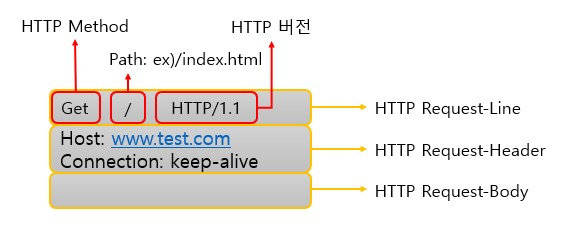
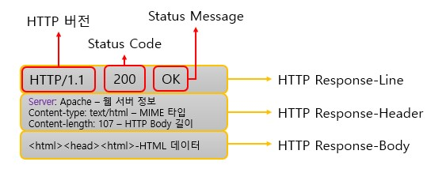
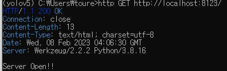
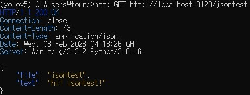

# Rest API

## HTTP(Hypertext Transfer Protocol)
* Server/Client 모델로 Request/Response 사용
    * Client에서 요청(Request)을 보내면, Server에서 응답(Response)을 하는 방식이다.
    * HTTP는 Connectionless 한 프로토콜이다. - 1회성 Request & Response
    * TCP/IP socket을 이용해서 연결한다.


### HTTP(Hypertext Transfer Protocol) Request/Response
* Request


### HTTP(Hypertext Transfer Protocol) Request/Response
* Response


## httpie
좀 더 빠르게 http의 응답을 cmd창에서 확인할 수 있게 해주는 오픈소스이다.  

### httpie 설치
- https://httpie.org/
- 윈도우
  ```bash
  pip install --upgrade pip setuptools
  pip install --upgrade httpie  
  ```
- 맥
  - Homebrew 가 설치 안되었다면
    - https://brew.sh/index_ko 가이드에 따라 Homebrew 설치
  - Homebrew 설치 후
  ```bash
  brew install httpie
  ```
  
  > 맥에서는 터미널 프로그램으로 현업에서는 iterm2 를 많이 사용함 <br>
  > iterm2 다운로드 및 설치는 해당 사이트 참조: https://www.iterm2.com/

<br>

### httpie 사용법
- http HTTP메서드 URI
  - HTTP메서드를 쓰지 않으면, 디폴트로 GET 
```bash
http GET http://localhost:8123/
```

- http -v URI
  - 송신 HTTP 프로토콜 데이터도 함께 출력
```bash
http -v GET http://localhost:8123/
```

아래와 같이 확인이 가능하다.  



## jsonify()
Flask에서 제공하여 주는 json 모듈이 있다.  
json 라이브러리와 동일하게 dict를 이용하여 데이터형식을 만들어주면 된다.

```py
from flask import Flask, jsonify

app = Flask(__name__)

@app.route("/jsontest")
def jsontest():
    data = {'file' : 'jsontest', 'text' : 'hi! jsontest!'}
    return jsonify(data)

if __name__ == "__main__":              
    app.run(host="127.0.0.1", port="8123")
```

결과:   

