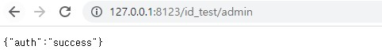
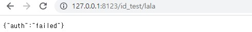
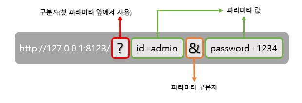
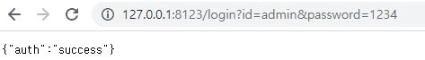

# Rest API
- REST(REpresentational State Transfer)
  - 자원(resource)의 표현(representation)에 의한 상태 전달
  - HTTP URI를 통해 자원을 명시하고, HTTP Method를 통해 자원에 대한 CRUD Operation 적용
    - CRUD Operation와 HTTP Method
      - Create: 생성 (POST)
      - Read: 조회 (GET)
      - Update: 수정 (PUT)
      - Delete: 삭제 (DELETE)

## Post와 Get의 차이

차이점 설명하기~~~~~~

## 1. json 로그인 기능 구현

제일 간단하게 json 통신을 보기 위하여 작성하였다.
```py
from flask import Flask, jsonify

@app.route("/id_test/<username>")
def test2(username):
    if username == "admin":
        return_data = {"auth" : 'success'}
    else:
        return_data = {"auth" : "failed"}

    return jsonify(return_data)

if __name__ == "__main__":              
    app.run(host="127.0.0.1", port="8123")
```

성공 시에는   

  

실패 시에는  

  
으로 결과를 볼수 있다.

## json 로그인 기능 구현(2)
두 번째로 구현할 방식은 get과 파라미터를 합친 방식이다.

### Rest API 요청시 파라미터/파라미터값 넣기
- HTTP 의 요청 방식 중, 가장 많이 사용되는 방식인 GET 방식을 사용한다.
  - GET 방식에서는 URI 상에 파라미터와 파라미터 값을 넣을 수 있음
    - 규칙: URL?파라미터1=파라미터1값&파라미터2=파라미터2값 
    - URL 이후 첫 파라미터 이름 전에 ? 를 표시하고, 추가 파라미터가 있을 시에는 & 표시로 구분한다.



### 실습
이러한 get방식의 요청을 받아주기 위해서는 flask의 __request__ 모듈을 사용하여야한다.

```py
from flask import Flask, jsonify, request

app = Flask(__name__)

@app.route("/login")
def login_test():

    username = request.args.get('id')
    passwd = request.args.get('password')

    if username == "admin":
        return_data = {"auth" : 'success'}
        if passwd == "1234":
            return_data = {"auth" : 'success'}
        else:
            return_data = {"auth" : "failed"}
    else:
        return_data = {"auth" : "failed"}

    return jsonify(return_data)

if __name__ == "__main__":              
    app.run(host="127.0.0.1", port="8123")
```

위의 코드에서 __request.args.get('파라미터 명')__ 파라미터의 값을 가져와서 결과를 반환하는 형식이다.  
따라서 그 결과는 아래와 같다  


## json 로그인 기능 구현(3)