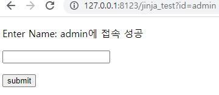
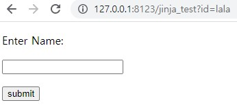
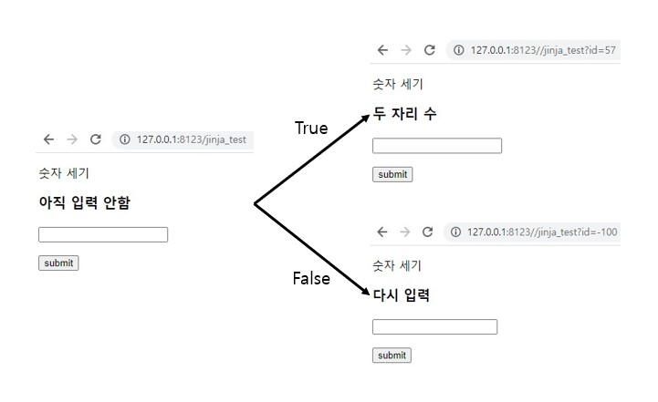

# Jinja2 템플릿
- 웹페이지에 필요한 부분을 변경할 필요가 있을 때 사용하는 간단한 문법
- 웹페이지에서 파이썬 프로그래밍이 가능
- 자바스크립트에서 Ajax와 같은 역할을 한다.

###  Jinja2 템플릿 엔진
- jinja2 템플릿 엔진이 해당 HTML 코드를 템플릿으로 만들고, 템플릿 안에 파이썬 코드를 실행하여, 템플릿을 채운 후 최종 HTML 파일 생성

HTML에서 제일 기본 적인 선언은 {{ 변수명 }} 과  이다.

## flask 영역

먼저 flask 영역이다. flask에서는 간단하게 __render_template( )__ 으로 반환할 때 html에 작성되어 있는 변수명에 맞혀서 값을 보내주면 된다.


```py
@app.route("/jinja_test")
def jinja_test():
    id = request.args.get('id')

    if id == 'admin':
        # 이걸로 template을 보낸다.
        return render_template("05.template_test.html", login_name = id + "에 접속 성공")
    else:
        return render_template("05.template_test.html")
```
성공(admin 입력)

 

실패(lala 입력)



## html 영역
### 변수 선언
```html
<p>Enter Name: {{ 변수명 }}</p>
```

### 반복문
- for 로 선언하고, endfor 로 끝내야한다.
- 들여쓰기는 없어도 된다.

```html
<!-- 기본 -->
  

<!-- 실사용 -->

{{ value }}

```
으로 사용되며 {{ value }} 부분을 \<li> {{ value }} \</li> 로 사용하여서 표현하여도 된다.

```py
list = [i for i in range(10)]
return render_template("05.template_test.html", values = list)
```
flask에서는 아래와 같이 list의 이름을 맞혀서 반환시켜 주면 된다.
<br>
 

### 반복문 + 추가
파이썬에서 제일 많이 사용하는 range()를 html에서도 사용이 가능하다.

- range() : 파이썬과 동일
  - for index in range(len(values)) 는 정상동작하지 않음
  
- len(values) : values | length 로 작성해야 함
- loop.index : 반복문 횟수를 반복문 안에서 가져올 수 있음
- value[index] : 파이썬 리스트와 동일

```html
<ul>
    
    <li>{{ values[index] }} {{ loop.index }}</li>
    
</ul>
```


### 조건문
- 기본 문법: if, elif, else, endif 로 구성 가능
- 위와 동일하게 들여쓰기는 없어도 된다.
- 조건문이기 때문에 flask에서 넘겨줄 때 아무값도 없으면 서버 에러가 생긴다.
```
    
```
 
아래의 코드는 간단하게 양수를 입력받았을 때 몇 자리수인지 나타내는 코드이다.
```html
    <p>숫자 자릿수 세기</p>
    
    <h3>세 자리 수 이상</h3>
    
    <h3>두 자리 수</h3>
    
    <h3>세 자리 수</h3>
    
    <h3>아직 입력 안함</h3>
    
    <h3>다시 입력</h3>
    
```
여기서 보면 -1에 대한 case를 만들어서 제일 처음 접속했을 때의 상황을 만들어준다.

```py
@app.route("/jinja_test")
def jinja_test():
    id = request.args.get('id')
    if id != None:
        id = int(id)
    else:
        id = -1

    return render_template("05.template_test.html", data = id)
```
처음 서버에 접속하였을 때는 값이 없어서 넘겨줄 데이터가 없기 때문에 -1로 초기화한다.  
이러한 패턴을 이용하여 html 파일에 로그인 기능을 만들 수도 있다.  

