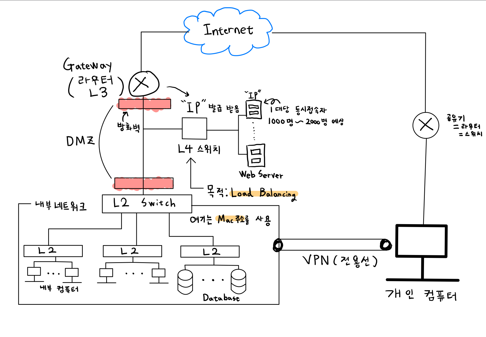
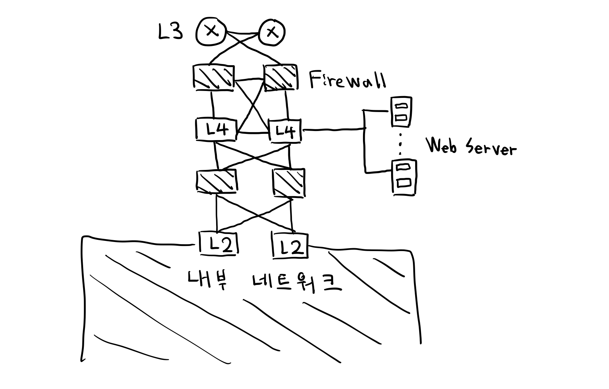

# 인프라 구조

 

* 대부분의 학교나 회사 인프라 구조를 필기한 내용이다. 
* 하지만 이렇게 되면 문제점이 있다 바로 맨 상위 라우터가 문제가 발생하셨을 경우이다.
* 그렇기 때문에 우리는 문제가 발생하지 않게 설계하여야 한다.

# HA(High Availiablilty - 고가용성)

* 위와 같이 고가용성으로 설계하게 되면 장애가 발생하더라도 다른 동일한 장비들을 통하여 문제를 해결할 수 있게된다.
* 위와 같은 사진을 이중화(Redundancy or Fault Tolerance)라고 한다.