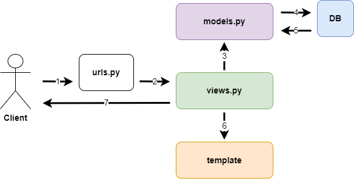
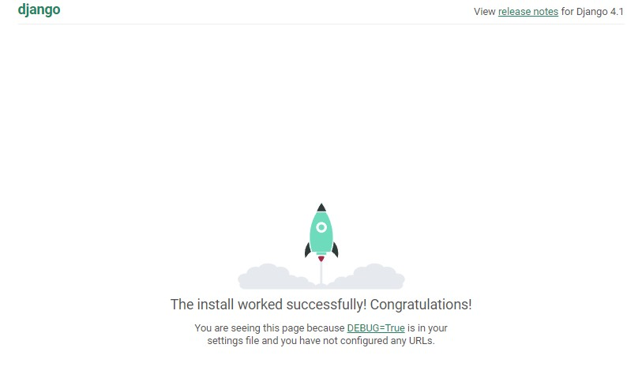

# Django

* 파이썬을 기반으로 만든 웹 프레임워크로 자바의 Spring과 같이 제일 점유율이 높은 프레임워크이다.

# MTV(Model - Template - View)

* MVT는 장고의 디자인 패턴이다.
* Spring의 MVC와 MVT로 거의 유사하게 대응된다. 
    $$ Model(MVC) = Model(MTV)$$
    $$ View(MVC) = Template(MTV) $$
    $$ Controller(MVC) = View(MTV) $$



* 차이점이 있다면 Controller 부분이다. MVC와 MTV 각각의 장단점이 있는데
* MVC 장단점:
    * 장점: Controller를 통하여 개발자가 전부 관여할 수 있다.
    * 단점: 관여를 할 수 있는만큼 신경써야 할 수 있는 부분도 많고 에러도 많이 발생한다.

* MTV 장단점:
    * 장점: View와 URL만 지정하여 준다면 나머지는 장고가 알아서 해주니까 개발도 빠르고 실수가 적다.
    * 단점: 디테일한 부분을 시스템에 맡긴 다는 단점이 있다.


# 설치

```bash
django-admin startproject [프로젝트명] [경로명]
```
* cmd 창에 위와 같이 입력하여 장고 프로젝트를 생성한다.

## Django 폴더 구조

```css
start_django/
--->start_django/
    --->__init__.py
    --->settings.py
    --->urls.py
    --->wsgi.py
--->manage.py
```

1. __start_django__ : Project 파일이 포함된 디렉토리로 모든 파일을 담는 용도 외에는 사용되지 않는다.

2. __start_django__ : Django 프로젝트 수행을 위한 패키지가 저장된 프로젝트이다.

    * __\_\_init.py\_\___ : Python 패키지 디렉토리임을 명시하는 파일이다. python 3.3 버전 부터는 이 파일이 없어도 패키지로 인식하긴 한다.

    * __settings.py__ : Django 프로젝트에서 모든 환경 설정을 관리하는 파일로 프로젝트에서 가장 큰 비중을 차지한다.

    * __urls.py__ : 프로젝트의 URL을 관리하는 파일이다. 추가 앱 생성 시 앱 별로 URL을 지정할 수 있지만, 프로젝트 root  디렉토리의 urls.py 파일에서 include를 시켜야만 URL을 지정한다는 점에서 이 파일을 웹 브라우저 상에서 관리되는 모든 URL을 관리하는 파일로 볼 수 있다.

    * __wsgi.py__ : WSGI(Web Service Gateway Interface)는 웹 호환 규격을 명시하는 파일로 별도로 작업을 할 때 사용되지는 않지만 웹 애플리케이션 가동을 위해서는 필수인 파일이다.

3. __manage.py__ : 

## Django 첫 실행

```bash
python manage.py runserver
```



* 첫 실행화면을 볼 수 있다.
* +추가) 파일들이 추가 된 것을 볼 수 있다.
    * __pycache/__ : 프로젝트 구동을 위한 컴파일된 파일을 포함하고 있음으로 파일이 없어도 실행이 가능하지만 성능에 저하가 될 수 있음으로 지우지 않는걸 권장한다.

    * __db.sqlite3__ : SQLiteDB이며, 프로젝트에서 다른 DB를 사용할 경우에 필요가 없는 파일이다.

# App 추가하기

```
django-admin startapp [App 이름]
```

* cmd 창에 입력하여 프로젝트에서 사용할 App들을 생성할 수 있다.

## 앱 폴더 구조

```css
start_django/
    start_django/

-------(생략)---------

    App 이름/
    --->migrations/
    --->__init__.py
    --->admin.py
    --->apps.py
    --->models.py
    --->tests.py
    --->views.py
```