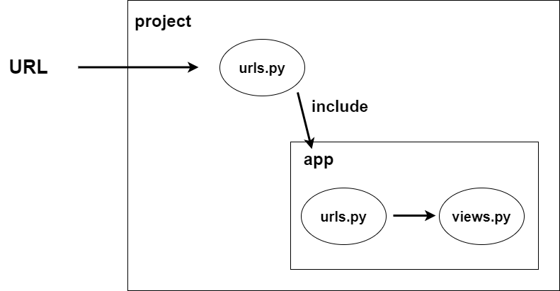
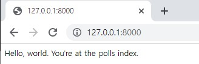

# URL과 View 기초

자세히 설명하기 전에 먼저 빠르게 구조를 살펴볼 예정이다.



* 먼저 개념을 설명하기 전에 URL이 형식을 장고가 받았을 때 response하기 위하여 타고 들어가는 방식이다.


## Project urls.py

```python
# urls.py
from django.urls import include, path

urlpatterns = [
    # 현재 사용하고 있는 앱의 이름은 "polls"이다.
    path('', include('polls.urls'))
]
```

* path는 url을 처리할 수 있도록 도와주는 함수이다.
* 첫 인덱스에는 처리할 url을 정한다.
* include를 사용하면 장고 프로젝트에서 앱이 사용하고 있는 urls파일로 맵핑할 수 있다.
    * 문자열로 "__앱이름(폴더명).urls(url파일)__" 를 넣는다.

## App urls.py

```python
# polls/urls.py

from django.urls import path
from . import views

urlpatterns = [
    path("", views.index, name='index')
]
```

* 기본적으로 앱을 생성하는 경우 __urls.py__ 는 기본적으로 생성이 안되기 때문에 파일을 추가해야 한다.
* views 파일에 연결해야하기 때문에 import를 한다.
* __views.함수이름__ 을 통하여 랜더링을 진행할 함수를 맵핑하여 준다.

```python
# polls/view.py

from django.shortcuts import render
from django.http import HttpResponse

def index(request):
    return HttpResponse("Hello, world. You're at the polls index.")
```

* urls에서 선언한 함수를 작성하여 response를 반환하여 주면된다.



# URLs

위에서는 빠르게 개념을 설명한 것이고, 여기서는 좀 더 자세하게 볼 예정이다.

## Path Converter

```py
path('birth/<int:year>/', views.birth_year)
```
* 위는 birth 다음에 int형만 받겠다고 URL 패턴을 정의하는 예시이다. 

```py
# views.py

def birth_year(request, year):
    return HttpResponse(year)
```  

* View에서는 URL에서 가져온 변수를 매개변수로 받아서 위와 같이 사용할 수 있다.  
* 따라서 아래와 같은 정의 가능한 옵션들이 있다.

### type

* __str__ : /(슬래쉬)를 제외한 모든 문자열과 매치된다. 타입이 지정되지 않으면 기본적으로 str 타입을 사용한다.
* __int__ : 0 혹은 양의 정수와 매칭 된다. 그 후, 파이썬의 int 타입으로 변환된다.
* __slug__ : slug 형식의 문자열(__ASCII, 숫자, -(하이픈), _(밑줄)__) 과 매치 된다.
* __uuid__ : UUID형식과 매칭되며 UUID란 중복되지 않는 유일한 값을 구성하고자 할때 사용되며, 세션 식별자, 쿠키 값, 무작위 데이터베이스 키 등에 사용된다.
* __path__ : /(슬래쉬)를 포함한 모든 문자열과 매치 된다. 위와 다른 용도로 사용하는 이유는 URL 패턴의 일부가 아니라 전체를 추출하고자 할 때 사용되어진다.


## 정규표현식

```py
from django.urls import re_path
from . import views

urlpatterns = [
    re_path(정규표현식, views.index, name='index')
]
```

* 좀 더 자세한 URL을 위한 정규표현식은 __re_path__ 함수를 이용하여 사용이 가능하다.