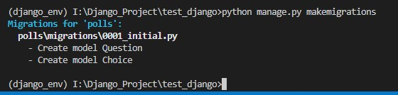
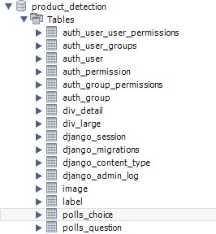

# 데이터베이스 연동

기본적으로 장고 프로젝트를 생성하게 되면 sqlite3가 자동적으로 같이 설치된다.  
하지만 실질적으로 우리가 사용하는 DB는 Mysql, Postgre 등과 같은 데이터 베이스를 사용한다.  
따라서 이번에는 MySQL을 설치하고 연동하는 법에 대하여 알아보겠다.

## MySQL 연동

```bash
# MySQL
pip install mysqlclient

#Postgre
pip install --no-binary :all: psycopg2
```

* 먼저 DB와 연동하는 라이브러리를 설치한다.

```py
# setting.py 파일

DATABASES = {
    'default': {
        'ENGINE': 'django.db.backends.mysql',
        'NAME': 'product_detection',
        'USER': 'root',
        'PASSWORD': '1234',
        'HOST': 'localhost',
        'PORT': '3306',
    }
}
```

* 그 후, settings.py에 있는 __DATABASES__ 를 위와 같이 수정하면 된다.
* __ENGINE__ : django.db.backends.사용하는 데이터베이스
* __NAME__ : 접속할 DB(스키마)를 적는다.
* __USER__ : 사용하는 DB 계정 ID
* __PASSWORD__ : 사용하는 DB 계정 비밀번호
* __HOST__ : 접속하는 현재 IP
* __PORT__ : 포트 번호

이렇게 하여서 DB와 연동이 끝나고 __python manage.py runserver__ 했을 때 오류가 발생한다면 연동이 잘 되지 않은 것이다.

# Migration

마이그레이션은 DB에 모델을 연결하고 모델에 생긴 변화(필드를 추가했다던가 모델을 삭제했다던가 등등)를 반영하는 Django의 방식이다.

## 앱 추가

```py
# settings.py 파일

INSTALLED_APPS = [
    'django.contrib.admin',
    'django.contrib.auth',
    'django.contrib.contenttypes',
    'django.contrib.sessions',
    'django.contrib.messages',
    'django.contrib.staticfiles',
    'polls.apps.PollsConfig'
]
```

* 앱에서 설정한 함수 및 클래스를 사용하기 위해서는 __INSTALLED_APPS__ 에 등록해줘야 한다.

* "앱이름.apps파일.PollsConfig함수" 를 입력하여 등록한다.

## 테이블 정의 및 변환

```py
# polls/models.py
from django.db import models

# Create your models here.
class Question(models.Model):
    question_text = models.CharField(max_length=200)
    pub_date = models.DateTimeField('date published')

class Choice(models.Model):
    question = models.ForeignKey(Question, on_delete=models.CASCADE) # 외래키
    choice_text = models.CharField(max_length=200)
    votes = models.IntegerField(default=0)
```

* models.Model을 상속 받아서 Question과 Choice table을 생성하는 예시이다.
* 여기서는 만들고 싶은 테이블과 속성을 정의하면  된다.

```bash
python manage.py makemigrations
```  

* 위의 명령어를 입력하게 되면 아래와 같이 모델을 생성하여 준다.
* 생성된 모델은 __앱이름/migrations__ 에서 확인 할 수 있다.  

  

```bash
python manage.py migrate
```

* 위의 명령어를 입력하게 되면 생성한 모델을 실제 DB에 테이블을 생성하여 준다.



* 위와 같이 "__앱이름_모델명__" 으로 테이블이 생성된 것을 확인할 수 있다.