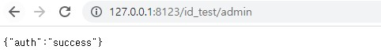
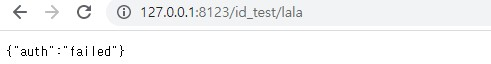
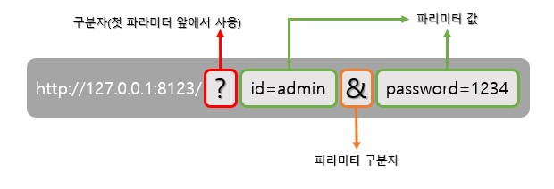
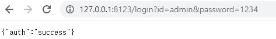
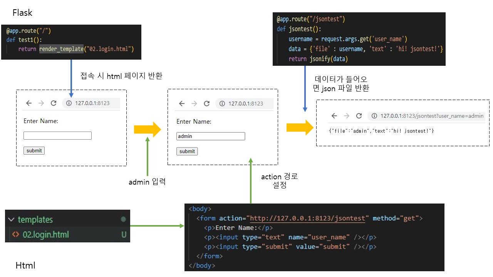

# Rest API
- REST(REpresentational State Transfer)
  - 자원(resource)의 표현(representation)에 의한 상태 전달
  - HTTP URI를 통해 자원을 명시하고, HTTP Method를 통해 자원에 대한 CRUD Operation 적용
    - CRUD Operation와 HTTP Method
      - Create: 생성 (POST)
      - Read: 조회 (GET)
      - Update: 수정 (PUT)
      - Delete: 삭제 (DELETE)

## Post와 Get의 차이

쉽게 생각하면 
* GET: 클라이언트에서 서버로 어떠한 리소스로부터 정보를 요청하기 위해 사용되는 메서드
* POST:  리소스를 생성/업데이트하기 위해 서버에 데이터를 보내는 데 사용

자세히 테이블로 비교하면
||GET|POST|
|------|:---:|:---:|
|브라우저 기록| O |X|
|캐시|O|X|
|북마크 추가|O|X|
|데이터 길이 제한|O|X|
|HTTP 응답 코드|200(Ok)|201(Created)|
|사용 용도|리소스 요청|리소스 생성|
|리소스 전달 방식|쿼리스트링|HTTP Body|
|idempotent|O|X|

### idempotent(멱등)
자주 나오는 용어라 알아두면 좋을 것 같아서 필기한다.  멱등(冪等)은 수학과 같은 전산에서 연산을 여러 번 적용하더라도 결과가 달라지지 않는 성질을 의미한다. 따라서 GET은 조회의 성질 때문에 결과가 잘 달라지지 않음으로 idempotent한 성격을 띄며, POST는 Non-idempotent한 성격을 띈다.

## 1. json 로그인 기능 구현

제일 간단하게 json 통신을 보기 위하여 작성하였다.
```py
from flask import Flask, jsonify

@app.route("/id_test/<username>")
def test2(username):
    if username == "admin":
        return_data = {"auth" : 'success'}
    else:
        return_data = {"auth" : "failed"}

    return jsonify(return_data)

if __name__ == "__main__":              
    app.run(host="127.0.0.1", port="8123")
```

성공 시에는   

  

실패 시에는  

  
으로 결과를 볼수 있다.

## json 로그인 기능 구현(2)
두 번째로 구현할 방식은 get과 파라미터를 합친 방식이다.

### Rest API 요청시 파라미터/파라미터값 넣기
- HTTP 의 요청 방식 중, 가장 많이 사용되는 방식인 GET 방식을 사용한다.
  - GET 방식에서는 URI 상에 파라미터와 파라미터 값을 넣을 수 있음
    - 규칙: URL?파라미터1=파라미터1값&파라미터2=파라미터2값 
    - URL 이후 첫 파라미터 이름 전에 ? 를 표시하고, 추가 파라미터가 있을 시에는 & 표시로 구분한다.



### 실습
이러한 get방식의 요청을 받아주기 위해서는 flask의 __request__ 모듈을 사용하여야한다.

```py
from flask import Flask, jsonify, request

app = Flask(__name__)

@app.route("/login")
def login_test():

    username = request.args.get('id')
    passwd = request.args.get('password')

    if username == "admin":
        return_data = {"auth" : 'success'}
        if passwd == "1234":
            return_data = {"auth" : 'success'}
        else:
            return_data = {"auth" : "failed"}
    else:
        return_data = {"auth" : "failed"}

    return jsonify(return_data)

if __name__ == "__main__":              
    app.run(host="127.0.0.1", port="8123")
```

위의 코드에서 __request.args.get('파라미터 명')__ 파라미터의 값을 가져와서 결과를 반환하는 형식이다.  
따라서 그 결과는 아래와 같다  


## json 로그인 기능 구현(3)

이제는 실제와 같이 서버에서 html을 뿌리고 html에서 get 받는 방식으로 설명하겠다.  
<br>

### __render_template__

```py
from flask import render_template
```

render_template을 사용하면 서버에서 지정한 url로 접속하였을 때 html을 뿌려줄 수 있다.  
단, 여기서 중요한 조건은 <span style='background-color: #fff5b1'>templates</span>라는 폴더를 만들고 그 폴더 안에 .html이 존재해야 flask가 읽을 수 있다.  
<br>
  
### html 설정

먼저 코드를 살펴 보겠다.  

```html
<!DOCTYPE html>
<html lang="en">
<head>
  <meta charset="UTF-8">
  <meta http-equiv="X-UA-Compatible" content="IE=edge">
  <meta name="viewport" content="width=device-width, initial-scale=1.0">
  <title>Document</title>
</head>
<body>
  <form action="http://127.0.0.1:8123/jsontest" method="get">
    <p>Enter Name:</p>
    <p><input type="text" name="user_name" /></p>
    <p><input type="submit" value="submit" /></p>
  </form>
</body>
</html>
```

여기서 제일 중요한 것은 <span style='background-color: #fff5b1'>action</span>이다. action을 사용해야 client가 정확한 목적지에 get을 보낼 수 있기 때문이다.  
그 후, input 값을 설정하여 안에 데이터를 넣어주면 된다.

### flask 설정
<br>
먼저 메인 url로 접속하였을 경우 html 파일을 반환하여준다.  

```py
@app.route("/")
def test1():                           
    return render_template("02.login.html")
```

그 후, html 파일에서 GET을 요청하였을 때 반환하는 코드이다.
```py
@app.route("/jsontest")
def jsontest():
    username = request.args.get('user_name')
    data = {'file' : username, 'text' : 'hi! jsontest!'}
    return jsonify(data)
```

### 전체 흐름

좀 더 쉽게 설명하여 전체적인 구조는 아래와 같다.<br>
