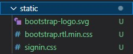
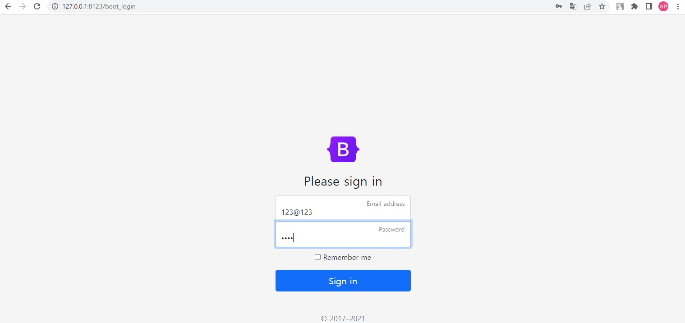
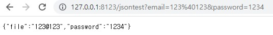

# BootStrap

대부분의 html 페이지는 html과 css만으로 짜는 경우가 없을 것이다. 제일 많이 사용되는 js 프레임워크로 실제로 어떻게 동작하는지 알아볼 것이다.

## html 영역

1. 먼저 [https://getbootstrap.com/docs/5.1/examples/](https://getbootstrap.com/docs/5.1/examples/) 에서 Bootstrap 예제를 다운 받으면 된다. 
2. Download examples를 클릭하여 다운받는다.
3. 다운 받은 폴더에서 사용할 sign-in 폴더를 찾고 안에 있는 index.html 파일을 templates로 옮긴다.
4. 옮긴 파일을 "04.login.html"으로 파일명을 변경한다.

여기까지했다면 이제 html에 사용된 css 파일들을 가져오고 경로를 바꿔야한다.
```html
<link href="../assets/dist/css/bootstrap.min.css" rel="stylesheet">

<link href="signin.css" rel="stylesheet">
```
5. 위의 경로에 파일들을 static이라는 새로운 폴더에 저장한다.
6. 다 옮긴 후 아래와 같이 경로를 다시 바꿔준다.



```html
<link href="../static/bootstrap.rtl.min.css" rel="stylesheet">

<link href="../static/signin.css" rel="stylesheet">
```
이제 마지막으로 메시지들을 어떻게 보낼 것인지 설정하여야 한다.

```html
<main class="form-signin">
  <form>
    ㅡㅡㅡㅡㅡ 내용들 ㅡㅡㅡㅡㅡ
  </form>
</main>
```
7. action과 method를 추가하여 Request를 작성하여 준다.

```html
<main class="form-signin">
  <form action="http://127.0.0.1:8123/jsontest" method="get">
    ㅡㅡㅡㅡㅡ 내용들 ㅡㅡㅡㅡㅡ
  </form>
</main>
```
8. 마지막으로 input 속성의 태그들에 "name"을 지정하여 준다.

```html
<input type="email" name = "email" class="form-control" id="floatingInput" placeholder="name@example.com">
<input type="password" name = "password" class="form-control" id="floatingPassword" placeholder="Password">
```

## Flask 영역

1. 제일 먼저 중요한것은 반환하여 주는 html 파일이 css파일을 사용할 수 있도록 아래와 같이 설정하여 준다.

```py
from flask import Flask, jsonify, request, render_template

app = Flask(__name__, static_url_path="/static")
```

2. html을 반환하는 라우팅 경로를 만든다.

```py
@app.route("/boot_login")
def bootstrap_test():
    return render_template("04.login.html")
```

3. 마지막으로 request 하는 경로를 만든다.

```py
@app.route("/jsontest")
def jsontest():
    username = request.args.get('email')
    pwd = request.args.get('password')
    data = {'file' : username, 'password' : pwd}
    return jsonify(data)
```
여기서 html의 name과 잘 맞혀야 파라미터가 넘어온다.

## 결과

http://127.0.0.1:8123/boot_login 에 접속 후 email은 "123@123", password는 "1234"를 입력한다.  


http://127.0.0.1:8123/jsontest?email=123%40123&password=1234 으로 결과가 출력된 것을 볼 수 있다.



