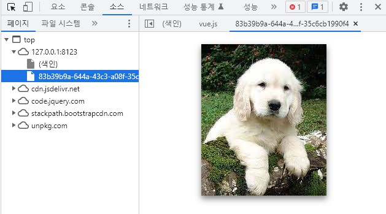

# Vue와 Axios

프론트앤드에서는 개발을 돕는 여러가지 프레임워크들이 있다.(리액트, next.js, Vue.....)  
여기서 이번에 사용할 프레임워크는 Vue다. 그리고 서버와 통신하기 위해서는 HTTP 통신이 필요한데 이번에 사용하기로 한 것은 Axios이다. Axios 외에 Ajax, fetch 등이 있지만 입문하기에는 Axios가 제일 좋다고 하여 사용하게 되었다.  

## CDN
- CDN(Contents Delivery Network) 은 지리적, 물리적으로 떨어져 있는 사용자에게 컨텐츠 제공자의 컨텐츠를 더 빠르게 제공할 수 있는 기술을 의미
- 사용자가 멀리 있는 서버로부터 컨텐츠를 다운로드 받으면, 시간이 오래 걸리므로, 사용자와 가까운 곳에 위치한 Cache Server에 해당 컨텐츠를 저장해놓고, 컨텐츠 요청시, 서버가 아닌,  Cache Server가 응답을 주는 기술
- 이번 프로젝트에서 사용되는 Vue와 Axios는 아래와 같이 body에 넣어서 호출하면 모듈을 사용할 수 있다. 

```html
<!-- Vue 모듈 -->
<script src="https://cdn.jsdelivr.net/npm/vue/dist/vue.js"></script>
<!-- Axios 모듈 -->
<script src="https://unpkg.com/axios/dist/axios.min.js"></script>
```

## CORS(Cross Origin Resource Sharing)
- 접속한 서버 외에 다른 서버에도 요청을 할 수 있게 하는 기능이다.

초기에는 서버와 통신할 경우는 프로토콜, 호스트명, 포트가 동일한 경우인 Same Origin Policy를 지키며 통신하였다. 하지만 시간이 지나며 한 클라이언트에서 여러 서버에 요청을 하는 일이 발생하였기 때문에 그를 해결하기 위해 나온 기능이라고 생각하면 편한다.

다행이 flask는 CORS를 지원하는 웹서버로 아래와 같이 실행하면 된다.
```py
from flask_cors import CORS

app = Flask(__name__)
CORS(app)
```

# Vue

Vue에 대한 전체적인 설명은 하지않고 사용하기 편한 이벤트 리스너 등에 대해서 설명하고 사용할 것이다.  
이번 예시는 사용자에게 이미지를 받고 웹페이지에 이미지를 띄우는 간단한 예시를 구현할 것이다.

```html
<form id = "test_axios">
    <center>
        <input type="file" v-on:change="image_save"/>
        <div v-if="preview"></div>
    </center>
</form>
```

* 제일 자주 사용하는 2가지 이벤트는 v-on:click 과 v-on:change가 있다.
    * __v-on:click__ : 버튼 등이 눌렸을 때 발생하는 이벤트를 다룬다.
    * __v-on:change__ : 태그가 무엇인가 입력을 받아서 상태가 변경되었을 때 발생하는 이벤트를 다운다.
* Vue는 작성하고 싶은 전체적인 영역을 id값으로 받아서 사용한다.
* __v-bind:src__ : Vue에서는 element의 속성을 동적으로 사용할 수 있다. 따라서 중간에 Vue를 통해 다른 값으로 교체가 가능하다.
* 주의) form 태그 안에 버튼 태그를 만들어서 보내면 무조건 get방식으로 보내는 특징이 있어서 post로 작성하고 싶다면 버튼 태그를 빼서 작성해야 한다.  
<br>

```javascript
let img_form;

const img_app = new Vue({
        el: "#test_axios",
        data: {
            preview: ''
        },
        methods: {
            image_save: function (event) {

                file_img = event.target.files[0]

                if (file_img && file_img.type.match(/^image\/(png|jpeg)$/)) {
                    this.preview = window.URL.createObjectURL(file_img) 
                }
                
                img_form = new FormData()
                img_form.append('test123', file_img)
        
            },
        },
        });
```

* Vue는 new Vue()를 통하여서 선언한다.
* 생성 시 __el: "#작업영역 태그"__ 를 지정하여 작업 영역을 생성한다. 생성된 작업영역 안에서는 Vue가 우선순위로 동작하여 외부 자바스크립트가 동작하지 않는 경우가 있다.
* __data: { }__ 을 통하여 작업 영역 안에 정의 되어있는 속성들의 속성 값을 선언할 수 있다.
* __method: { }__ 에서는 이벤트 작업을 위한 이벤트 함수를 선언하여 준다. 자바스크립트는 dict형태에서 함수를 사용할 수 있는 특성이 있다.  


위의 설명한 내용은 Vue를 사용하기 위한 대략적인 틀이다. 이제 추가 내용이다.

```javascript
file_img = event.target.files[0]
```
* 이벤트가 발생하였을 때 이벤트에 추가된 파일을 가져오며 "[0]"을 통해 제일 첫 번째 파일을 가져온다.
* 여기서 제일 중요한 점은 파일을 가져올 때 파일을 __blob__ 형태로 가져온다는 점이다.
* Blob(Binary Large Object)은  텍스트와 이진 데이터의 형태로 읽을 수 있으며 동작시 웹브라우저가 메모리를 할당하여 가지고 있다.

```javascript
this.preview = window.URL.createObjectURL(file_img)
```
* data: { }에서 입력된 속성을 사용하기 위해서는 새로운 변수가 아니라는 선언을 하기 위해 __this__ 를 사용한다.
* __window.URL.createObjectURL(blob명)__ : 웹브라우저가 가지고 있는 blob의 위치를 url형태로 반환 받는다.
* __v-bind:src__ 로 선언된 속성은 새로운 값을 받았을 때, 새로고침을 하지 않아도 웹브라우저에 새로운 값으로 다시 출력한다.

  
위의 사진과 같이 이미지를 받으면 웹브라우저는 blob형태로 사진을 가지고 있으며 그와 동시에 받은 사진의 위치를 자동으로 url을 생성한다.  
따라서 사용자는 저장된 이미지의 위치를 알지 못하기 때문에 __window.URL.createObjectURL()__ 을 통하여 위치를 가져온다.  
<br>

```javascript
    //전역
    let img_form;

    //Vue 내부
    img_form = new FormData()
    img_form.append('test123', file_img)
```
* Vue 내부에서 작업한 내용을 외부로 빼고 싶다면 전역변수를 사용하여서 해결하면 된다.
* HTTP 프로토콜에서는 파일을 전송 시에는 __FormData__ 객체로 만들어서 전송해야한다.
* __FormData.append('객체명', blob객체)__ : .append를 통하여 blob객체를 Formdata 안에 넣어준다. 서버는 Formdata에서 받은 특정 blob 객체를 추출하기 위해서는 객체명이 사용되는데 이때 사용되어진다.