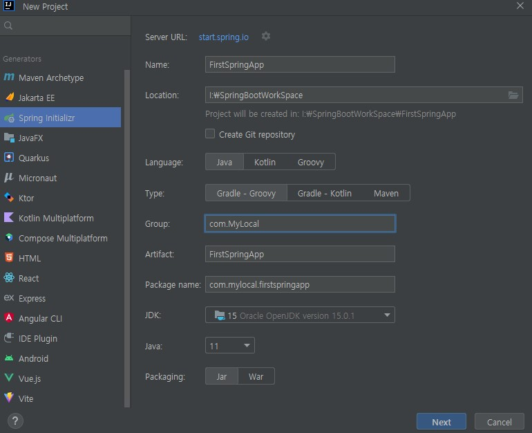
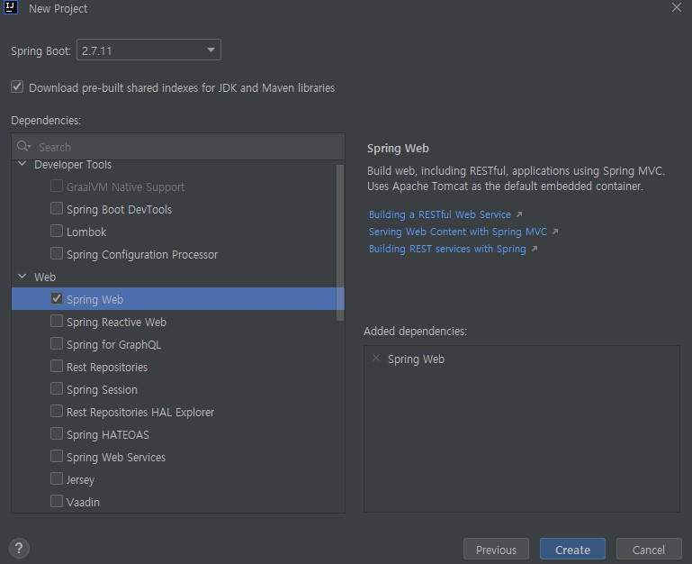

# Spring Boot 프로젝트 생성

IntelliJ의 Ultimate에서는 폴더 생성에서 쉽게 만들 수 있지만 없는 경우, [https://start.spring.io/](https://start.spring.io/)에 찾아가서 zip파일로 생성할 수 있다.

## Gradle과 Maven

Gradle과 Maven은 둘 다 프로젝트 관리 도구이다. 자세한 설명보다는 좀더 요약하여 말하자면  

* __Gradle__ : _Groovy_ 라는 스크립트 언어를 빌드처리하여 동작한다.
* __Maven__ : _XML_ 파일을 빌드처리하며 동작한다.

## Group과 Artifact

Group은 주로 회사의 도메인 명을 거꾸로 사용하며, Artifact는 프로젝트의 이름을 사용하는 경우가 많다.

마지막에 사용할 __Dependencies__ 를 추가하여 주면 된다.